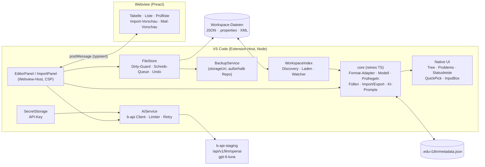

# Design: edu-sharing i18n – VS-Code-Extension

> **Status:** Entwurf zur Abnahme · **Datum:** 24.09.2026
> **Grundlagen:** Standalone-App `janschachtschabel/i18n-translator` (Commit `d248399`),
> Anforderungsliste `anforderungen.txt` („potential tool features (for vscode plugin?)", Staging-Kopie der App),
> edu-sharing-Repo (`maven/fixes/11.0`, lokaler Clone), Live-Test der b-api-staging mit `gpt-6-luna` (24.09.2026),
> Ergänzung im Chat (24.09.2026): generisch für weitere Sprachen/Felder; Prüfen, Füllen, Import, Export; Import i. d. R. aus einer in VS Code geöffneten Datei.
> **Taskliste:** [`2026-09-24-edu-sharing-i18n-vscode-tasks.md`](2026-09-24-edu-sharing-i18n-vscode-tasks.md)

---

## 1. Ziel

Eine VS-Code-Extension, mit der die Übersetzungsdateien von edu-sharing (Angular-JSON, Metadatasets-`.properties`,
Mail-Templates-XML) **direkt im Repository geprüft, gefüllt, importiert und exportiert** werden – barrierearm, im
jeweiligen VS-Code-Theme (hell, dunkel, hoher Kontrast), mit KI-Unterstützung über die b-api (`gpt-6-luna`),
ohne Datenverlust und mit minimalen Git-Diffs. Die Extension ist **generisch**: weitere Sprachen, Felder,
Bereiche und Dateiformate lassen sich per Einstellung bzw. über eine Adapter-Schnittstelle ergänzen.

## 2. Kontext

### 2.1 Ausgangslage

- **Standalone-App** (FastAPI + React/Vite/Tailwind): Tabellen-Editor je Bereich, Filter „Missing"/„Errors",
  KI-Vorschlag pro Zelle, KI-Batch-Fill, KI-Review, Statistik, Einstellungen, Backups, ZIP-Download.
  Die Daten liegen als Kopie in `data/1.0.0/` neben der App, nicht im edu-sharing-Repo.
- **`anforderungen.txt`** (liegt nur in der Staging-Kopie `C:\Users\jan\staging\Windsurf\i18nTranslator`) ist ausdrücklich als
  Feature-Liste für ein VS-Code-Plugin formuliert. Sie wird hier als „alter Vorschlag" behandelt (siehe offene Frage F1).
  Inhalte: Kategorienliste ein-/ausblendbar, Tabellen- **und** Listenansicht, ein-/mehrzeilig, Sprachen
  ein-/ausblenden ohne Sprung im Viewport, Kontext-Hinweis und Kontext-URL je Key, Key-Operationen mit
  Scope-Abfrage, Filter mit Regex, umfassende Qualitätsprüfungen, Review-Status, Mail-Vorschau,
  Backups außerhalb der Datenordner, **„keine leeren Keys einfügen"**.
- **Neu (Chat):** generisch für weitere Sprachen und Felder; vier Hauptaktionen **Prüfen · Füllen · Import · Export**;
  Import in der Regel aus einer in VS Code geöffneten Datei.

### 2.2 Wie edu-sharing die Dateien zur Laufzeit liest

Die Prüfregeln leiten sich aus dem tatsächlichen Laufzeitverhalten ab, nicht aus Vermutungen:

| Bereich | Ort im Repo | Laufzeitverhalten (Quelle) | Konsequenz für das Plugin |
|---|---|---|---|
| **Angular** | `Frontend/src/assets/i18n/{kategorie}/{sprache}.json` | `translation-loader.ts`: Alle Kategorien einer Sprache werden in fester Reihenfolge (`TRANSLATION_LIST`, `override` zuletzt) **flach auf oberster Ebene** zusammengeführt. Spätere Kategorien überschreiben gleichnamige Top-Level-Keys **für die ganze App**. `{{GENDER_SEPARATOR}}` wird zu `*`. Fehlende Keys fallen auf die Default-Sprache zurück (`de-*` → `de`). | Ein leerer Wert `""` ist schlimmer als ein fehlender Key, weil er den Fallback überschreibt. Die Varianten `de-informal` und `de-no-binnen-i` sind **dünn besetzt** (sie enthalten nur Abweichungen). Neue Prüfregeln: „überschrieben durch spätere Kategorie" und „Teilbaum geht verloren". |
| **Metadatasets** | `config/defaults/src/main/resources/metadatasets/i18n/{gruppe}[_{locale}].properties` | `MetadataReader.getTranslation`: Reihenfolge `{i18n}_override_{locale}` → `{i18n}_{locale}` → `{i18n}_override` → `{i18n}`. Gelesen wird über `PropertyResourceBundle` (Java 9+: UTF-8 mit Rückfall auf ISO-8859-1, **je Datei**). | Das **Encoding bleibt je Datei erhalten**: Im Repo sind 12 Dateien UTF-8 und 13 ISO-8859-1. Die Basisdatei ohne Suffix ist Englisch („default"). |
| **Mail** | `config/defaults/src/main/resources/mailtemplates/templates[_{locale}].xml` | `MailTemplate`: Ein Template wird über (`name`, `context`) identifiziert. Fehlt es in der Locale-Datei, greift `templates.xml`; zusätzlich sind `_override`-Dateien möglich. | XML wird **chirurgisch** bearbeitet: CDATA, `<style>`, Einrückung und `context` bleiben erhalten. Ein fehlendes Template bedeutet einen Rückfall auf Englisch. |

**Nachtrag (Review Block B): Produktions-Builds führen anders zusammen.** Die Zeile „Angular" beschreibt den Loader
im Frontend. Er gilt, wenn Übersetzungen lokal geladen werden (Entwicklung). Im Produktions-Build
(`production: true`, Quelle `Auto`) holt `translation-loader.ts` die Texte stattdessen über
`/config/v1/language/defaults` vom Backend. `I18nAngular.getLanguageStrings` führt dort **jeden** Ordner unter
`assets/i18n` zusammen, und zwar in der Reihenfolge von `File.listFiles()`, die nicht festgelegt ist. Folgen:

- Auch Kategorien außerhalb von `TRANSLATION_LIST` werden geladen.
- Welcher Text bei einem Konflikt gewinnt, kann vom Entwicklungs-Build abweichen. Die Merge-Regeln melden den
  Konflikt trotzdem richtig. Den Gewinner nennen sie nach der Reihenfolge der Bereichsdefinition („spätere in
  der Merge-Reihenfolge"), nicht als Tatsache der Laufzeit.
- Für Sprachen außer `de-*` liest das Backend `{sprache}.json`, ohne zu prüfen, ob die Datei existiert. Eine
  fehlende Datei lässt deshalb vermutlich den ganzen Aufruf scheitern. Zur Laufzeit ist das nicht verifiziert;
  `missing-file` bleibt vorerst eine Warnung.
- Nur die exakte Schreibweise `{{GENDER_SEPARATOR}}` wird ersetzt (Frontend und Backend). Andere
  Schreibweisen meldet `placeholder-malformed`.

### 2.3 Probelauf der geplanten Prüfregeln am echten Repo

Ein nur lesender Python-Prototyp der Regeln lief gegen den lokalen Clone (`maven/fixes/11.0`):

| Bereich | Befund | Anzahl |
|---|---|---|
| Angular (17 Kategorien, 3.914 Keys in `de`) | fehlende Keys gegenüber `de` (en 89 · fr 214 · it 215 allein in `common`) | 975 |
| | fehlende Sprachdateien (`editorial` fr/it, `topic-page` fr/it) | 4 |
| | **Platzhalter weichen ab**, z. B. `common/it COMMON_API_ERROR_TITLE`: `{{data}}` statt `{{date}}` | 10 |
| | **kaputte Platzhalter**, z. B. `admin/en …STATUS_WARN`: `Current {{{count}} is/are…` | 22 |
| | leere Werte / verwaiste Keys (z. B. `admin/fr ADMIN.STATISTICS.VIEWS`) | 12 / 15 |
| | `de-informal` fehlt, obwohl `de` die Sie-Form nutzt · `de-no-binnen-i` fehlt trotz Gender-Platzhalter | 133 · 6 |
| | gleicher Top-Level-Key in mehreren Kategorien mit **anderem Text** (spätere gewinnt app-weit) · verlorene Teilbäume | de 27, en 3, fr 1, it 3 · 0 |
| | identisch mit Referenz (viele legitim: „Minute", „CC-0") | 338 |
| Metadatasets (7 Gruppen, 25 Dateien) | fehlende Keys gegenüber `de_DE` (`valuespaces_i18n` fr/it je 1.232 von 1.546) | 2.605 |
| | doppelte Keys in einer Datei · Dateien in ISO-8859-1 | 14 · 13 |
| Mail (4 Sprachen, 22 Templates in `templates.xml`) | Template `added_inbox` fehlt in fr_FR und it_IT | 2 |
| | Platzhalter-Abweichung (`userRegister`, `{{image:…}}`) | 1 |

Die Regeln finden also echte Laufzeitfehler, und ihre Lautstärke lässt sich über Schweregrade steuern.
Heuristische Befunde (zum Beispiel „identisch mit Referenz") landen deshalb nicht im Problems-Panel.

### 2.4 Probleme der Standalone-App, die nicht übernommen werden dürfen (verifiziert)

| # | Problem (Standalone) | Folge | Lösung im Plugin |
|---|---|---|---|
| 1 | JSON wird über Punkt-Keys flachgeklopft und neu verschachtelt | Keys mit Punkten wie `mail.smtp.server` oder MIME-Typen werden zerlegt. **8 Dateien** (`admin`/`common` × de/en/fr/it) würden beim Speichern beschädigt | Key-Pfade als Segment-Arrays, minimale Edits mit `jsonc-parser` |
| 2 | Speichern schreibt die ganze JSON-Datei neu | Formatierung und Reihenfolge ändern sich, die Diffs werden unnötig groß | Nur der betroffene String-Literal wird ersetzt |
| 3 | Mail-XML wird aus `subject`/`message` komplett neu aufgebaut | `<style>` des Templates `stylesheet` geht verloren, das `context`-Attribut ebenso. `&`/`<` im Betreff werden nicht escaped, dadurch entsteht **ungültiges XML** | Positionsgenauer Tokenizer; Betreff wird escaped, Nachricht bleibt CDATA-sicher |
| 4 | `.properties` werden immer als UTF-8 geschrieben, Trennzeichen werden zu `key: value` normalisiert | Große Diffs, das Encoding kippt, Escapes (`\uXXXX`, `\:`) gehen verloren | Zeilenerhaltender Parser; Encoding je Datei bleibt, nicht darstellbare Zeichen werden `\uXXXX` |
| 5 | „Neuer Key" legt in **allen** Sprachen `""` an, „Neue Sprache (base_on)" ebenso | Der Fallback wird überschrieben, die UI zeigt leeren Text | Leere Werte werden nie automatisch angelegt; neue Sprache startet mit `{}` |
| 6 | Die Referenzsprache `de` existiert in MDS und Mail nicht (dort `de_DE`) | Referenzbasierte Prüfungen laufen dort ins Leere | Locale-Normalisierung (`de` ≙ `de_DE`) |
| 7 | Platzhaltervergleich ohne Normalisierung | `{{ name }}` und `{{name}}` gelten als Fehler, `{{GENDER_SEPARATOR}}` zählt als Variable, `{{{count}}` bleibt unentdeckt | Eigener Platzhalter-Scanner (normalisiert, erkennt Syntaxfehler) |
| 8 | KI mit `temperature` und `max_tokens`, Batch-Antwort als nummerierte Zeilen | Mit `gpt-6-luna` gibt es **HTTP 400** (live getestet), das Parsen ist fragil | Modellprofile (`max_completion_tokens`, `reasoning_effort`), Ausgabe per JSON-Schema |
| 9 | Quick-Fill übernimmt KI-Ergebnisse ungeprüft | Fehlübersetzungen landen direkt in den Dateien | Immer Prüfliste; KI-Werte werden als „Prüfung erforderlich" markiert |
| 10 | API-Key im Klartext in `config.json` | Geheimnis im Dateisystem bzw. im Repo | VS Code SecretStorage (oder `B_API_KEY`) |
| 11 | Aktionen nur bei Hover sichtbar, Tooltips nur per Maus, Status teils nur über Farbe | Per Tastatur und mit Screenreader nicht bedienbar | WCAG-2.2-AA-Konzept (Abschnitt 7.4) |

## 3. Umfang

**In scope (v1):**
- Generisches Modell aus Bereich, Einheit, Eintrag, Feld und Sprache. Presets für edu-sharing Angular, Mail und MDS; eigene Bereiche sind per Einstellung möglich.
- Format-Adapter: `json-nested`, `json-flat`, `properties`, `mail-xml`.
- **Prüfen**: Regelkatalog (Abschnitt 6.5) mit Problems-Panel, Tree-Badges, Statusleiste und Filtern im Editor.
- **Bearbeiten**: Übersetzungseditor (Webview) mit Tabellen- und Listenansicht; Key- und Sprachoperationen; sicheres Schreiben; Undo in der Sitzung; Backups.
- **Füllen**: Übersetzungsspeicher, KI (b-api/`gpt-6-luna`) und Referenzkopie auf ausdrücklichen Wunsch, jeweils mit Prüfliste. Dazu Varianten-Generierung und KI-Qualitätsprüfung.
- **Import**: aus der aktiven Editor-Datei (auch ungespeichert), aus einer Datei oder der Zwischenablage. Formate: CSV/TSV, JSON (verschachtelt, flach, mit Export-Hülle), `.properties`, Mail-XML. Automatische Zuordnung, Vorschau, Übernahme.
- **Export**: als neues ungespeichertes Dokument in VS Code oder als Datei; Formate wie beim Import.
- Kontext-Hinweise, Kontext-URLs, Review-Status und akzeptierte Warnungen in einer Metadaten-Datei.
- Übersicht über die Abdeckung (Einheiten × Sprachen).
- UI auf Deutsch und Englisch; Themes hell, dunkel und hoher Kontrast; WCAG 2.2 AA.

**Out of scope (v1):**
- Bearbeitung der MDS-XML-Dateien (`metadatasets/xml`) und von Konfigurations-Overrides außerhalb der i18n-Dateien. In der Anforderungsliste ist das noch offen („Torsten fragen").
- XLIFF-Import/-Export (vorgesehen für v1.x), Übersetzungs-Plattformen (Weblate, Crowdin).
- Hover und Go-to-Definition für Übersetzungs-Keys im TypeScript/HTML-Quellcode (Idee für später).
- Veröffentlichung im VS-Code-Marketplace oder bei Open VSX (v1 erscheint als VSIX über GitHub Releases, siehe Entscheidung E6).
- Verschieben von Zeilen zwischen Kommentar-„Abschnitten" in `.properties`.

## 4. Lösungsansätze

**Ansatz A – Eigene VS-Code-Extension (TypeScript), native VS-Code-Bausteine plus Webview-Editor** ✅ *Empfehlung*
- *Wie:* Navigation, Prüfergebnisse und Dialoge nutzen native VS-Code-Elemente (Tree View, Problems-Panel, QuickPick, InputBox, SecretStorage). Das Tabellen-Editing läuft in einer Webview. Alle Datei- und KI-Operationen passieren im Extension Host.
- *Pro:* passt sich an VS Code an (Themes, Tastatur, Screenreader); keine Python-Abhängigkeit; läuft auch remote (WSL/SSH) und in Forks; Dateien bleiben im Repo, Git zeigt die Diffs.
- *Contra:* Die Tabellen-UI muss neu gebaut werden, React-Komponenten lassen sich nur konzeptionell übernehmen.
- *Aufwand:* ca. 20–25 Entwicklertage für alle Phasen (grobe Schätzung). *Risiko:* Formattreue beim Schreiben, abgefangen durch Golden-Tests.

**Ansatz B – Standalone-App (FastAPI + React) in eine Webview einbetten**
- *Wie:* Die Extension startet das Python-Backend, die Webview lädt `localhost`.
- *Pro:* Der bestehende Code wird weiterverwendet.
- *Contra:* Python-Laufzeit und Port-Verwaltung nötig, kein Theme-Bezug, unsauber in Remote-Szenarien und Forks. Die Datenverlust-Probleme aus Abschnitt 2.4 würden übernommen, ebenso die Barrieren.
- *Aufwand:* kurzfristig gering, danach hoch. *Risiko:* Datenverlust.

**Ansatz C – i18n Ally konfigurieren oder erweitern**
- *Pro:* verbreitete Extension für ngx-translate-JSON und `.properties`.
- *Contra:* **Seit 12/2024 ohne Release** (v2.13.2, 476 offene Issues). Keine edu-sharing-Spezifika (Mail-XML, dünne Varianten, flaches Merge, Encoding je Datei). Die b-api-Authentifizierung über `X-API-KEY` und die GPT-6-Parameter werden nicht unterstützt.

**Empfehlung A:** Nur dieser Ansatz erfüllt „generisch", „ohne Datenverlust", „barrierearm" und „VS-Code-typisch" zugleich.

## 5. Globale Vorgaben

- TypeScript `strict`. Extension Host mit Node ≥ 20 (global `fetch`). **VS Code ≥ 1.90**, damit auch Forks laufen (Windsurf/Devin 1.126, Antigravity 1.107); keine Proposed APIs.
- `src/core/**` und `src/webview/**` dürfen **nicht** `vscode` importieren. `src/core/**` nutzt außerdem weder Node-APIs (`node:*`) noch DOM-Globals, damit Extension Host, Webview und CLI-Skripte ihn gleichermaßen verwenden können. Die Webview darf den Kern importieren (z. B. für die Sofortprüfung von Platzhaltern), aber nie Extension-Code. Das erzwingt ESLint über `no-restricted-imports`. So bleibt der Kern mit vitest testbar und später als CLI oder CI-Prüfung nutzbar.
- Bezeichner, Code-Kommentare und Commit-Messages auf Englisch; die Dokumentation für Nutzer auf Deutsch (README zusätzlich auf Englisch).
- **Byte-Treue:** Beim Schreiben bleiben unveränderte Bytes identisch. Encoding, BOM, Zeilenenden, Einrückung, Trennzeichen, Kommentare und Reihenfolge bleiben erhalten.
- **Keine leeren Werte automatisch anlegen.** Leeren ist nur als ausdrückliche Aktion „Wert entfernen" möglich (entfernt den Key und stellt damit den Fallback wieder her).
- Jeder Massenvorgang (KI-Füllen, Import, Löschen oder Umbenennen über mehrere Einheiten) zeigt vorher eine Vorschau bzw. einen modalen Dialog und legt ein Backup an.
- API-Schlüssel nur in SecretStorage bzw. `B_API_KEY`; nie in Settings, Logs, Webview oder Fehlermeldungen.
- Testdaten sind **synthetisch** nachgebaut, denn edu-sharing steht unter GPL-3.0, das Plugin unter Apache-2.0. Abnahmetests gegen das echte Repo laufen lokal gegen einen Clone.
- Keine Telemetrie.

## 6. Architektur

### 6.1 Überblick



Abhängigkeitsrichtung: `extension` → `core` ← `webview` (nur über `shared/protocol.ts`). `core` hängt von nichts
Plattformspezifischem ab.

### 6.2 Generisches Datenmodell

| Begriff (UI) | Code | Angular | Metadatasets | Mail |
|---|---|---|---|---|
| **Bereich** | `AreaDefinition` | „Angular JSON" | „Metadatasets" | „Mail-Templates" |
| **Einheit** | `Bundle` | Kategorie `common` | Gruppe `valuespaces_i18n` | `templates` |
| **Sprache** | `LocaleCode` | `de`, `de-informal`, `fr` | `default` (=en), `de_DE` | `default` (=en), `fr_FR` |
| **Eintrag** | `EntryKey` (Segment-Array) | `["ADMIN","APPLICATIONS","CCMAIL","mail.smtp.server"]` | `["ccm:educationalcontext"]` | `["invited"]` (+ `context`) |
| **Feld** | `FieldId` | `value` | `value` | `subject`, `message` (dynamisch aus XML-Kindelementen) |
| **Zelle** | Eintrag × Feld × Sprache | Text | Text | Text/HTML |

- Sprachen werden **aus den Dateinamen abgeleitet**, es gibt keine feste Liste. Dazu gehören Anzeigenamen per `Intl.DisplayNames` (z. B. `fr` → „Französisch") und optionale KI-Beschreibungen je Sprache (Einstellung).
- **Varianten** (dünn besetzte Sprachen) sind deklarativ beschrieben (`base`, `requiredWhen`, `forbidden`, KI-Anweisung). Vorkonfiguriert sind `de-informal` und `de-no-binnen-i`.
- Neue **Felder** entstehen automatisch, wenn ein Format mehrere Felder kennt (Mail: jedes übersetzbare Kindelement; `style` ist nicht übersetzbar).

### 6.3 Bereichsdefinitionen und Presets

Presets sind eingebaut und lassen sich per `eduI18n.areas` überschreiben oder ergänzen. Die Wurzelordner werden automatisch erkannt:

| Preset | Erkennungsmuster (Workspace) | Dateimuster | Locale-Muster | Referenz |
|---|---|---|---|---|
| `edu-sharing.angular` | `**/common/de.json` → Wurzel = übergeordneter Ordner | `{bundle}/{locale}.json` | `[a-z]{2}(-[a-z0-9]+)*` | `de` |
| `edu-sharing.mds` | `**/metadatasets/i18n/mds.properties` | `{bundle}[_{locale}].properties` | `[a-z]{2}_[A-Z]{2}` | `de_DE` |
| `edu-sharing.mail` | `**/mailtemplates/templates.xml` | `templates[_{locale}].xml` | `[a-z]{2}_[A-Z]{2}` | `de_DE` |

Beispiel für einen eigenen Bereich (Einstellung `eduI18n.areas`):

```json
{
  "id": "kunde.overrides",
  "label": "Kunden-Overrides",
  "format": "json-nested",
  "roots": ["customer/i18n"],
  "files": "{bundle}/{locale}.json",
  "localePattern": "[a-z]{2}(-[a-z0-9]+)*",
  "referenceLanguage": "de"
}
```

Zusätzliche Preset-Attribute für Angular: `bundleOrder` (Standard: `TRANSLATION_LIST` aus `translation-loader.ts`)
und `mergeSemantics: "shallow-toplevel"` (aktiviert die Regeln `key-overridden` und `subtree-lost`). MDS kennt außerdem
`ignoredKeys: ["this_is_a_bug_the_first_line_will_not_be_translated"]`: Diese technische Wächterzeile wird ausgeblendet,
aber mitgeschrieben.

Ein Assistent „Bereich hinzufügen…" (Ordner wählen → Format → Muster mit Live-Vorschau der erkannten Dateien)
schreibt die Definition in die Workspace-Einstellungen.

### 6.4 Format-Adapter und verlustfreies Schreiben

```ts
export interface FormatAdapter {
  readonly id: 'json-nested' | 'json-flat' | 'properties' | 'mail-xml';
  readonly fieldMode: 'single' | 'dynamic';
  decode(bytes: Uint8Array): DecodedText;                 // text, encoding ('utf-8'|'latin-1'), bom, eol
  parse(doc: DecodedText): ParsedFile;                    // entries (key, fields, ranges), order, problems
  edit(doc: DecodedText, parsed: ParsedFile, ops: readonly FileOp[]): TextEdit[];   // minimal edits
  encode(text: string, like: DecodedText): Uint8Array;    // same encoding; latin-1: unmappable -> \uXXXX
  createEmpty(ctx: NewFileContext): string;               // '{}\n' | '<templates>\n</templates>\n' | header (+ sentinel line)
}

export type FileOp =
  | { kind: 'set'; key: EntryKey; field: FieldId; value: string }
  | { kind: 'insert'; key: EntryKey; fields: Record<FieldId, string>; after?: EntryKey }
  | { kind: 'delete'; key: EntryKey }
  | { kind: 'rename'; from: EntryKey; to: EntryKey };
```

| Format | Parser | Schreibstrategie |
|---|---|---|
| `json-nested` | `jsonc-parser` `parseTree` (Positionen, doppelte Keys, Nicht-String-Werte) | `jsonc-parser` `modify`/`applyEdits` mit Segment-Pfad. Einrückung und Zeilenende werden aus der Datei erkannt (edu-sharing: 2 Leerzeichen, LF, Newline am Ende); Einfügen nach einem Geschwister-Key über `getInsertionIndex` |
| `json-flat` | wie oben, Keys = ganze Strings | wie oben |
| `properties` | eigener zeilenerhaltender Parser: logische Zeilen, Fortsetzungen `\`, Escapes (`\uXXXX \: \= \t \n \\`), Kommentare `#`/`!`, Trennzeichen `:`/`=`/Leerraum | Nur der Wertbereich der Zeile wird ersetzt; Trennzeichen und Abstände bleiben. Encoding: strikt UTF-8, sonst ISO-8859-1. Zeichen außerhalb von Latin-1 werden als `\uXXXX` geschrieben |
| `mail-xml` | eigener Tokenizer mit Positionen: `<template name context>`, Kindelemente, CDATA/Text, Entities | `subject` mit XML-Escaping; `message` als CDATA (enthaltenes `]]>` wird auf zwei CDATA-Abschnitte verteilt). Alles andere bleibt unberührt |

> **Stand Phase 2 (Tasks, Entscheidungen B3/B4):** Der JSON-Adapter schreibt mit eigenen Textoperationen
> (`applyOps` liefert den neuen Text statt `TextEdit[]`); `jsonc-parser` dient nur zum Parsen, weil `modify`
> benachbarte Zeilen neu formatiert. `encode(doc)` nimmt das Dokument samt Encoding und BOM.

**Golden-Regeln (Tests für jeden Adapter):**
1. Laden und ohne Änderung schreiben ergibt **byte-identische** Dateien.
2. Eine geänderte Zelle ergibt genau **eine** geänderte Zeile im Diff (bei mehrzeiligen Werten nur deren Zeilen).
3. Einfügen und Löschen verändern die Formatierung der Nachbarn nicht.

### 6.5 Prüfregeln (Katalog)

Schweregrade sind je Regel über `eduI18n.checks.severity` überschreibbar (`error` · `warning` · `info` · `off`).
Befunde vom Typ „Hinweis" erscheinen standardmäßig nur im Editor (Filter und Symbole), **nicht** im Problems-Panel.

| Regel | Standard | Problems-Panel | Was sie findet | Beispiel aus dem Repo |
|---|---|---|---|---|
| `parse-error` | Fehler | ja | Datei nicht lesbar (JSON, XML, Properties) | – |
| `placeholder-malformed` | Fehler | ja | Syntaxfehler `{{{x}}`, `{{x}`, `{x}}`, `{{}}` | `admin/en`: `Current {{{count}} is/are…` (22×) |
| `placeholder-mismatch` | Fehler | ja | Parameter weichen von der Referenz ab (Leerraum und `{{GENDER_SEPARATOR}}` werden ignoriert) | `common/it COMMON_API_ERROR_TITLE`: `{{data}}` statt `{{date}}` (10×) |
| `condition-unbalanced` | Fehler | ja | Mail: `{{if …}}` ohne `{{endif}}`, andere Bedingungen als in der Referenz | – |
| `subtree-lost` | Fehler | ja | Angular: Top-Level-Objekt in mehreren Kategorien, frühere Keys sind zur Laufzeit unerreichbar | aktuell 0 (Schutz vor künftigen Fehlern) |
| `missing-file` | Warnung | ja | Sprachdatei fehlt in einer Einheit | `editorial`, `topic-page`: fr, it |
| `missing-key` | Warnung | **gebündelt** je Datei | Key fehlt in einer vollständigen Sprache (Rückfall auf die Default-Sprache) | 975 |
| `missing-template` | Warnung | ja | Mail-Template oder -Feld fehlt (Rückfall auf `templates.xml`) | `added_inbox` in fr_FR, it_IT |
| `empty-value` | Warnung | ja | leerer Text, obwohl die Referenz (bei Varianten die Basis) einen Text hat: `""` überschreibt den Fallback, die UI zeigt leeren Text. In der Referenz ebenfalls leere Texte gelten als gewollt | 0 (alle 17 leeren Werte im Repo sind auch in der Referenz leer) |
| `orphan-key` | Warnung | ja | Key existiert nur in der Zielsprache (veraltet oder falsch einsortiert) | 15 |
| `misplaced-key` | Warnung | ja | verwaister Key, dessen letztes Segment zu einem fehlenden Key passt; Vorschlag „verschieben" | – |
| `key-overridden` | Warnung | ja | gleicher Top-Level-Key in mehreren Kategorien mit anderem Text; die spätere Kategorie gewinnt app-weit | de 27 · en 3 · fr 1 · it 3 |
| `duplicate-key` | Warnung | ja | Key doppelt in derselben Datei (der letzte gewinnt) | MDS: 14 |
| `variant-needed` | Warnung | ja | `de` enthält die Sie-Form bzw. `{{GENDER_SEPARATOR}}`, die Variante hat keine eigene Fassung | `de-informal` 133 · `de-no-binnen-i` 6 |
| `html-mismatch` | Warnung | ja | HTML-Tags weichen von der Referenz ab; nur echte HTML-Elemente, Wörter in spitzen Klammern wie `<keine>` sind Text | 22 (z. B. fehlendes `<b>` in `WORKSPACE.SHARE.PUBLISH_ACTIVE_DOCUMENT`) |
| `variant-inconsistent` | Hinweis | nein | informelle Variante enthält die Sie-Form (heuristisch) | 5 (teils „Sie" = „they") |
| `variant-orphan` | Hinweis | nein | Varianten-Key ohne Basis-Key | 2 |
| `same-as-reference` | Hinweis | nein | identisch mit der Referenz, evtl. unübersetzt (mind. 4 Buchstaben, Ignorierliste) | 338 |
| `inconsistent-translation` | Hinweis | nein | gleicher Referenztext wurde unterschiedlich übersetzt | Phase 7 |
| `review-required` / `reference-changed` | Hinweis / Warnung | ja | Metadaten: KI- oder Import-Wert noch ungeprüft; Referenztext seit dem Review geändert | Phase 7 |
| `lowercase-key` | aus | – | optionale Heuristik aus der Anforderungsliste | – |

**Vollständige vs. Varianten-Sprachen:** Ein Key fehlt in Sprache L, wenn die Referenz ihn hat und L nicht; so zählt
auch der Probelauf in 2.3 („gegenüber de"). Keys, die nur Übersetzungen haben, meldet `orphan-key` (oder
`misplaced-key` mit Vorschlag) bei den Sprachen, die sie haben. Die Anforderungsliste sprach von „reference: all other
languages"; umgesetzt ist der Vergleich mit der Referenz (angeglichen im Audit vom 26.09.2026, M-04). Varianten gelten nur dann als lückenhaft, wenn
`requiredWhen` auf den Basistext zutrifft.

**Warnungen akzeptieren:** „Als OK markieren" speichert einen Fingerabdruck (Regel, Eintrag, Sprache und Hash der
beteiligten Texte) in den Metadaten. Ändert sich der Text, erscheint die Warnung wieder.

### 6.6 Füllen

Es gibt vier Quellen. In der UI stehen sie in dieser Reihenfolge; jede endet in derselben **Prüfliste**:

1. **Übersetzungsspeicher (ohne KI):** Derselbe Referenztext ist anderswo bereits übersetzt (im Bereich oder in allen Bereichen). Das Ergebnis ist ein Vorschlag mit Häufigkeit, z. B. „Abbrechen → Annuler (12×)".
2. **KI (b-api):** Einzelzelle, Auswahl, Einheit × Sprache oder Bereich × Sprache; außerdem Varianten-Generierung (`de` → `de-informal` bzw. `de-no-binnen-i`).
3. **Import-Datei** (siehe 6.7).
4. **Referenz kopieren:** nur als ausdrückliche Aktion und markiert mit „Prüfung erforderlich". Die Anforderungsliste wünscht das für Mail-Templates.

Mögliche Filter: *fehlend* · *leer* · *Variante nötig* · *Prüfung erforderlich* · *Auswahl*.
Ablauf: erzeugen, dann die Prüfliste (je Eintrag: übernehmen, bearbeiten oder verwerfen; ungültige Vorschläge sind
abgewählt und begründet), dann „N Änderungen übernehmen". Dabei wird ein Backup angelegt, es wird gebündelt
geschrieben, der Review-Status gesetzt und die Prüfung läuft automatisch.

### 6.7 Import und Export

**Import** – Quelle ist standardmäßig die **aktive Editor-Datei** (auch ungespeichert oder „Untitled"). Alternativ
gibt es die Dateiauswahl und die Zwischenablage. Aufrufbar ist der Import über die Befehlspalette, das Menü im
Editor-Titel bei `json`/`csv`/`properties`/`xml`, die Tree-Einträge und die Werkzeugleiste des Übersetzungseditors.

| Format | Erkennung | Import | Export |
|---|---|---|---|
| CSV/TSV (Excel) | Kopfzeile mit `key` und Sprachspalten (optional `area`, `bundle`, `field`, `context`); Trennzeichen `;` `,` `\t`; BOM | ✓ | ✓ (UTF-8 mit BOM, `;`, Excel-tauglich) |
| JSON verschachtelt | Objekt mit String-Blättern (wie eine edu-sharing-Datei); Sprache aus dem Dateinamen | ✓ | ✓ |
| JSON flach | `{ "A.B.C": "Text" }` | ✓ | ✓ |
| JSON mit Export-Hülle | `{ "$edu-i18n": { "area", "bundle", "locales", … }, "entries": … }`; die Zuordnung erfolgt vollautomatisch | ✓ | ✓ (Standard für den Rundlauf) |
| `.properties` | `key: value` | ✓ | ✓ |
| Mail-XML | `<templates>` | ✓ | ✓ |
| XLIFF 2.0 | – | v1.x | v1.x |

**Zuordnung:** Die Zielzuordnung wird in dieser Reihenfolge ermittelt: Hülle, dann Dateiname und Pfad (`…/common/fr.json`), dann
größte Überschneidung der Keys mit einer Einheit. Bestätigt wird per QuickPick (Bereich, Einheit, Sprache[n]).
Liegt die geöffnete Datei selbst in einem erkannten Bereich, schlägt das Plugin „Prüfen" statt „Importieren" vor.

**Vorschau (Webview „Import-Vorschau"):** Zähler *neu · geändert · identisch · unbekannter Key · ungültig*.
Die Tabelle zeigt Key, Sprache, aktuellen und importierten Wert, Status und Prüfhinweise; auf die importierten Werte
laufen dieselben Regeln. Optionen: *Vorhandene überschreiben* (aus), *Unbekannte Keys anlegen* (aus), *Leere Werte
ignorieren* (immer an), *als „Prüfung erforderlich" markieren* (an).

**Export:** Umfang (Einheit, Bereich oder Auswahl) · Sprachen (Ziel[e], optional mit Referenzspalte) · Filter (alle,
fehlend, mit Problemen, Prüfung erforderlich) · Format. Das Ergebnis öffnet sich standardmäßig als **neues
ungespeichertes Dokument** in VS Code (Sprachmodus passend gesetzt). Alternativ: „Speichern unter…".
Damit schließt sich der Rundlauf: *Export „fehlend fr" → Übersetzer*in → Datei in VS Code öffnen → Import → Prüfen.*

### 6.8 KI-Anbindung (b-api / `gpt-6-luna`)

- **Endpoint:** `{baseUrl}/api/v1/llm/{provider}/chat/completions`, Header `X-API-KEY` (**kein** Bearer).
  Voreinstellung: `https://b-api.staging.openeduhub.net`, Provider `openai`, Modell `gpt-6-luna`.
- **Live gemessen am 24.09.2026:** `gpt-6-luna` antwortet in 1,2–4 s.
  - `temperature` ≠ 1 und `max_tokens` werden mit **HTTP 400** abgewiesen. Pflicht ist `max_completion_tokens`.
  - `reasoning_effort` ∈ `none | low | medium | high | xhigh` (`minimal` wird mit 400 abgewiesen). Reasoning-Tokens zählen zum Budget (beobachtet: 134 von 182 Tokens).
  - `response_format: json_schema` (strict) und Streaming funktionieren.
- **Modellprofile** (erlauben den Modellwechsel ohne Codeänderung):
  - `gpt-5*`/`gpt-6*`/`o*`: `max_completion_tokens` und `reasoning_effort`, kein `temperature`.
  - AcademicCloud-Modelle: `max_tokens` und `temperature: 0`. `qwen3*` zusätzlich mit `chat_template_kwargs.enable_thinking=false`; bei Mistral entfällt dieses Flag.
  - Die Antwort wird aus `content` gelesen, mit Rückfall auf `reasoning`.
- **Voreinstellungen:**
  - Übersetzen mit `reasoning_effort: low`, Review mit `medium`, Einzelvorschlag optional mit `none`.
  - Batch mit 25 Einträgen, max. 2 parallele Requests (konservativ, der Wert lässt sich erhöhen) und 120 s Timeout.
  - Wiederholung bei 429/502/503/504 mit 2,5 s · 2ⁿ, höchstens 4 Versuche.
  - Bei `finish_reason: length` wird der Batch geteilt.
- **Prompt-Kontext:**
  - Key-Pfad und Einheit, Referenztext und vorhandene Übersetzungen anderer Sprachen (en hilft bei fr/it).
  - Sprach- bzw. Variantenbeschreibung und Kontext-Hinweis aus den Metadaten.
  - Benachbarte Keys (Terminologie) und Glossar aus Treffern des Übersetzungsspeichers.
  - Regeln: Platzhalter, HTML und `{{if}}` exakt erhalten; `{{GENDER_SEPARATOR}}` nur im Deutschen; Typografie je Sprache; ähnliche Länge (Buttons).
- **Validierung jeder Antwort** mit denselben Regeln wie bei der Prüfung (Platzhalter, HTML, Bedingungen, leer, Längenverhältnis). Ungültige Vorschläge werden nie automatisch übernommen.
- **Sicherheit und Datenschutz:**
  - Der Schlüssel liegt in SecretStorage (Befehl „API-Schlüssel setzen"), Rückfall auf die Umgebungsvariable `B_API_KEY`.
  - Übertragen werden nur UI-Texte, Keys und Hinweise, keine personenbezogenen Daten.
  - Beim ersten Einsatz erscheint ein einmaliger Hinweis; `eduI18n.ai.enabled` schaltet die KI ab.
  - Im eingeschränkten Modus (nicht vertrauenswürdiger Workspace) ist die KI deaktiviert.
- **Befehl „KI-Verbindung testen"** fragt `/models` ab, prüft die Verfügbarkeit des Modells (Modell-IDs ändern sich ohne Ankündigung) und sendet einen Mini-Request.

### 6.9 Metadaten (Kontext, Review, akzeptierte Warnungen)

Datei `.edu-i18n/metadata.json` im Workspace-Root (Pfad per Einstellung änderbar; leer = nur lokal im
`workspaceState`). Sortierte Keys, 2 Leerzeichen, LF – damit bleiben die Diffs gut lesbar:

```json
{
  "schemaVersion": 1,
  "entries": {
    "edu-sharing.angular/common/COMMON_API_ERROR_TITLE": {
      "hint": "Titel des Fehlerdialogs; {{date}} = Zeitpunkt des Fehlers",
      "contextUrl": "/components/workspace",
      "locales": { "fr": { "status": "review-required", "source": "ai", "refHash": "9f2c41d0" } }
    }
  },
  "accepted": { "same-as-reference|edu-sharing.angular/common/MINUTE|fr|5d1e": "2026-09-24" },
  "mailTitles": { "invited": "Einladung zu einem Material" }
}
```

- **Review-Status:** `review-required` · `reviewed`. Werte aus KI und Import erhalten `review-required`.
  Eine menschliche Bearbeitung setzt `reviewed` (abschaltbar, siehe F3). „Review anfordern" funktioniert für eine Sprache,
  eine Einheit oder einen Abschnitt.
- **`reference-changed`:** Ändert sich der Referenztext nach dem Review (anderer `refHash`), wird die Übersetzung als veraltet markiert.
- **Kontext-URL:** relativ zu `eduI18n.context.baseUrl`. Sie öffnet im Simple Browser von VS Code oder im externen Browser.
- **Mail-Titel:** Die in der Anforderungsliste gewünschten lesbaren Namen landen in den Metadaten, das Template-XML bleibt unverändert.
- Beim Umbenennen oder Löschen eines Keys werden die Metadaten mitgezogen.

### 6.10 Dateizugriff in VS Code

| Aspekt | Lösung |
|---|---|
| Finden | `workspace.findFiles` mit Erkennungsmustern der Presets bzw. Bereiche. Standardmäßig ausgeschlossen: `node_modules`, `dist`, `target`, `build`, `.git`. Mehrere Workspace-Ordner werden unterstützt |
| Lesen | `workspace.fs.readFile`, dann Adapter-`decode` (Encoding-Erkennung je Datei) |
| Beobachten | `FileSystemWatcher` je Wurzel, 300 ms Debounce, inkrementelle Neuindizierung. Offene Editor-Tabs erhalten ein Patch-Update |
| Schreiben | Semantische `FileOp`s → Adapter-`edit` → Bytes → `workspace.fs.writeFile`. Eine Warteschlange je Datei; Revisionsprüfung (Hash). Wurde die Datei extern geändert, wird neu geladen und die Operation auf den neuen Stand angewandt |
| Dirty-Guard | Ist die Zieldatei in einem Editor **ungespeichert geändert**, wird abgebrochen. Die Meldung „Bitte speichern oder verwerfen" bietet an, die Datei zu zeigen |
| Undo | Undo-Stapel der Sitzung (Befehl und `Strg+Z` im Editor außerhalb von Eingabefeldern). Wiederhergestellt wird der vorherige Byte-Stand, sofern die Datei seitdem unverändert ist |
| Backups | vor dem ersten Schreibvorgang einer Sitzung, vor Massenoperationen, alle N Minuten bei Änderungen, manuell. Ablage in `context.storageUri/backups/<Zeitstempel>/…`, **außerhalb des Repos**. Die letzten N bleiben erhalten; Wiederherstellen per QuickPick |
| Eingeschränkter Modus | `untrustedWorkspaces: limited`: nur Anzeige und Prüfung, kein Schreiben, keine KI |
| Remote | läuft als Workspace-Extension (WSL, SSH, Dev Container); die KI-Aufrufe erfolgen vom Remote-Host |

### 6.11 Projektstruktur

```
i18n-translator-vscode/
├─ package.json · package.nls.json · package.nls.de.json · l10n/bundle.l10n.de.json
├─ esbuild.mjs · tsconfig*.json · eslint.config.mjs · vitest.config.ts · .vscode-test.mjs
├─ media/            Activity-Bar-Icon, Extension-Icon
├─ src/
│  ├─ core/          (reines TypeScript – kein vscode, kein DOM)
│  │  ├─ model/      types.ts · keys.ts · locale.ts · bundle.ts
│  │  ├─ area/       areaDefinition.ts · filePattern.ts · presets.ts
│  │  ├─ discovery/  discover.ts
│  │  ├─ text/       edits.ts · lineIndex.ts
│  │  ├─ formats/    adapter.ts · json/ · properties/ · mail/
│  │  ├─ checks/     placeholders.ts · html.ts · variants.ts · runChecks.ts · rules/*.ts
│  │  ├─ fill/       translationMemory.ts · fillPlan.ts
│  │  ├─ exchange/   csv.ts · jsonExchange.ts · detect.ts · mapping.ts · importPlan.ts · exportPlan.ts
│  │  ├─ ai/         modelProfiles.ts · bapiClient.ts · prompts.ts · schemas.ts · validate.ts
│  │  ├─ meta/       metadata.ts
│  │  └─ util/       limiter.ts · hash.ts
│  ├─ extension/     (VS-Code-Anbindung)
│  │  ├─ extension.ts · config.ts
│  │  ├─ services/   workspaceIndex.ts · fileStore.ts · backupService.ts · secretService.ts · aiService.ts · metadataService.ts
│  │  ├─ views/      areasTree.ts · statusBar.ts
│  │  ├─ diagnostics/diagnosticsPublisher.ts
│  │  ├─ commands/   *.ts (je Befehl eine Datei)
│  │  └─ panels/     editorPanel.ts · importPanel.ts · webviewHtml.ts · messageRouter.ts
│  ├─ shared/        protocol.ts · viewModel.ts
│  └─ webview/       (Preact) main.tsx · app.tsx · state/ · components/ · a11y/ · styles/
├─ test/
│  ├─ unit/          (vitest, spiegelt src/core und src/webview)
│  ├─ integration/   (@vscode/test-cli, Fixture-Workspace)
│  └─ fixtures/      synthetische edu-sharing-artige Dateien inkl. Grenzfällen
├─ scripts/          check-repo.ts (CLI für die Abnahme gegen einen lokalen Repo-Clone)
└─ docs/             plans/ · verification/ · user-guide.md
```

Richtwert: keine Datei über ca. 300 Zeilen. Jede Prüfregel und jeder Befehl liegt in einer eigenen Datei.

### 6.12 Nachrichtenprotokoll Host ↔ Webview (Auszug)

```ts
type WebviewToHost =
  | { type: 'ready' }
  | { type: 'edit'; bundleId: string; entryId: string; field: string; locale: string; value: string; baseRevision: string }
  | { type: 'aiSuggest'; requestId: string; bundleId: string; entryId: string; field: string; locale: string }
  | { type: 'fillStart'; requestId: string; plan: FillRequest } | { type: 'fillCancel'; requestId: string }
  | { type: 'applyChanges'; requestId: string; changes: CellChange[]; source: 'ai' | 'tm' | 'import' | 'copy' }
  | { type: 'command'; command: 'addKey' | 'renameKey' | 'deleteKey' | 'addLanguage' | 'import' | 'export' | 'openContextUrl'; args: unknown }
  | { type: 'uiState'; state: UiState };

type HostToWebview =
  | { type: 'init'; l10n: Record<string, string>; settings: WebviewSettings; uiState: UiState }
  | { type: 'bundle'; model: BundleViewModel } | { type: 'patch'; changes: CellPatch[]; issues: IssueView[] }
  | { type: 'aiSuggestion'; requestId: string; result?: Suggestion; error?: UserError }
  | { type: 'fillProgress'; requestId: string; done: number; total: number; items: Suggestion[] }
  | { type: 'writeResult'; requestId?: string; ok: boolean; error?: UserError };
```

Jede eingehende Nachricht wird zur Laufzeit validiert. Werte aus den Dateien werden in der Webview **nur als Text**
gerendert, nie über `innerHTML`. Einzige Ausnahme ist die Mail-Vorschau in einem sandboxed `iframe srcdoc` ohne Skripte.

### 6.13 Abhängigkeiten

| Paket | Zweck | Warum dieses |
|---|---|---|
| `jsonc-parser` (Microsoft) | JSON mit Positionen und minimalen Edits | Die VS Code eigene Bibliothek; `JSON.parse` liefert keine Positionen und ermöglicht keine formattreuen Edits |
| `preact`, `@preact/signals` | Webview-UI (~5 KB) | React-ähnlich (das Team kennt React aus der Standalone-App), klein und schnell. Native HTML-Elemente bringen die beste Barrierefreiheit |
| `@vscode/codicons` | Icons | dieselben Icons wie VS Code, lokal eingebunden |
| *(keins)* für HTTP, CSV, XML | – | `fetch` ist in Node 20 eingebaut. CSV (RFC 4180) und der XML-Tokenizer sind klein und brauchen Positionen, deshalb eigener Code mit Tests |
| Dev: `typescript`, `esbuild`, `vitest`, `happy-dom`, `@testing-library/preact`, `axe-core`, `@vscode/test-cli`, `@vscode/test-electron`, `@vscode/vsce`, `eslint`, `typescript-eslint`, `prettier`, `@types/vscode@1.90`, `@types/node@20` | Build, Tests, Barrierefreiheitstests, Paketierung | Standardwerkzeuge für VS-Code-Extensions |

Nicht verwendet: `@vscode/webview-ui-toolkit`, seit 01.01.2025 abgekündigt und archiviert.
`@vscode-elements/elements` ist als Alternative geprüft, aber nicht gewählt: Shadow-DOM-Komponenten erschweren die
Verknüpfung von Labels, und ein editierbares Grid ist nicht enthalten (siehe Entscheidung E2).

## 7. UI/UX in VS Code

### 7.1 Platzkonzept

- **Navigation in der nativen Seitenleiste** (Activity-Bar-Eintrag „edu-sharing i18n"): Bereiche und Einheiten mit Zählern
  (`1.437 · ✖ 5 · ⚠ 518`); Mail-Templates als Unterknoten; Kontextmenü mit *Öffnen · Prüfen · Füllen · Import ·
  Export · Sprache hinzufügen*. Die Seitenleiste lässt sich mit `Strg+B` einklappen; das erfüllt die Anforderung „Kategorienliste ausblenden".
- **Übersetzungseditor als Editor-Tab** je Einheit. Er wird wiederverwendet, lässt sich in einen Split ziehen oder in einem eigenen Fenster öffnen.
- **Responsive Layouts:**

  | Breite | Layout |
  |---|---|
  | ab 900 px | Tabelle (Key-Spalte plus Sprachspalten, Kopfzeile und Key-Spalte fixiert) |
  | unter 900 px | Liste (je Key eine Karte mit beschrifteten Sprachfeldern) |
  | bis 480 px | kompakte Liste (Referenz plus eine Zielsprache) |

  Die Ansicht lässt sich jederzeit umschalten.
- **Fokus-Modus „Übersetzen":** Referenz und eine Zielsprache nebeneinander. Mit `Alt+↓` geht es zum nächsten offenen Punkt.
- **Sprachen ein- und ausblenden, ohne dass der Viewport springt.** Der oberste sichtbare Key dient als Anker.
- **Ein- oder mehrzeilig**, global oder je Zeile. Mehrzeilige Felder wachsen mit, sodass nie innerhalb einer Zelle gescrollt werden muss.
- **Details-Leiste** (auf breiten Bildschirmen rechts, auf schmalen unten): alle Sprachen, Befunde mit Erklärung und Lösungsvorschlag, Kontext-Hinweis, Kontext-URL, Review-Status, KI- oder Speicher-Vorschlag.
- **Native Dialoge** für Key- und Sprachoperationen (InputBox mit Validierung, modale Rückfragen mit Scope, zum Beispiel *„Nur in dieser Kategorie" · „In allen Kategorien" · „Abbrechen"*).
- **Zustand bleibt erhalten** je Einheit: Ansicht, sichtbare Sprachen, Filter und Zeilenmodus („keep selection for future use").

### 7.2 Tastatur

| Aktion | Taste |
|---|---|
| Zwischen Zellen bewegen | Pfeiltasten, `Pos1`/`Ende`, `Bild↑`/`Bild↓`, `Strg+Pos1`/`Strg+Ende` |
| Bearbeiten | `Enter` oder `F2` |
| Speichern | `Enter` (einzeilig) bzw. `Strg+Enter` (mehrzeilig) |
| Abbrechen | `Esc` |
| Speichern und zur nächsten Zelle | `Tab` bzw. `Umschalt+Tab` |
| Nächster / vorheriger offener Punkt | `Alt+↓` / `Alt+↑` |
| KI-Vorschlag für die Zelle | `Strg+I` (übernehmen mit `Enter`, verwerfen mit `Esc`) |
| Suche | `Strg+F` |
| Filter „fehlend" | `Alt+M` |
| Tastenkürzel-Hilfe | `?` |

Alle Funktionen sind zusätzlich über die Befehlspalette erreichbar.

### 7.3 Hell, dunkel, hoher Kontrast

Die Webview nutzt ausschließlich die Theme-Variablen von VS Code (`--vscode-*`) und die Body-Klassen
`vscode-light`, `vscode-dark` und `vscode-high-contrast` (inkl. `-light`). Damit folgt sie **automatisch** jedem Farbschema;
ein eigener Umschalter ist nicht nötig. Statusfarben stammen aus Theme-Tokens (`editorError`, `editorWarning`,
`inputValidation-*`). Im Modus hoher Kontrast kommen `contrastBorder` und `contrastActiveBorder` hinzu. Werte erscheinen
in der UI-Schrift, Keys in der Editor-Schrift. Die Mail-Vorschau zeigt die E-Mail realistisch hell; sie lässt sich auf
das Theme umschalten.

### 7.4 Barrierefreiheit (Ziel: WCAG 2.2 AA)

- **Semantik:**
  - Tabelle nach dem ARIA-**Grid-Muster** (`role="grid"`, Spalten- und Zeilenköpfe, `aria-rowcount`/`aria-rowindex`, roving `tabindex`).
  - Die **Listenansicht** ist die gleichwertige, formularbasierte Alternative (beschriftete Felder, Überschriften je Key).
- **Nie nur Farbe:** Jeder Status hat Symbol und Text („fehlt", „Platzhalter-Fehler", „KI – prüfen"). Für Screenreader gibt es verknüpften Beschreibungstext (`aria-describedby`).
- **Tastatur:** Alles ist per Tastatur erreichbar, es gibt keine Fallen. Aktionen sind nicht nur per Hover sichtbar (Zeilenaktionen erscheinen bei Fokus und über das Kontextmenü `Umschalt+F10`). Sprunglinks führen zu „Filter" und „Tabelle".
- **Fokus:** sichtbar (`--vscode-focusBorder`) und nicht von fixierten Kopfzeilen verdeckt (WCAG 2.4.11). Nach einem Dialog kehrt der Fokus zur auslösenden Stelle zurück.
- **Meldungen:** `aria-live` für „Gespeichert", Fortschritt der KI und Import-Zusammenfassung (WCAG 4.1.3). Fehlermeldungen nennen die Ursache und die Lösung (WCAG 3.3.1 und 3.3.3).
- **Größen:** Klickziele mindestens 24 × 24 px (WCAG 2.5.8). Relative Einheiten, die Zoom und Schriftgröße von VS Code berücksichtigen. Umbruch bei 320 px Breite in der Listenansicht (WCAG 1.4.10).
- **Bewegung und Hilfen:** `prefers-reduced-motion` wird beachtet, es gibt kein Blinken. Tooltips erscheinen auch bei Fokus und sind nie die einzige Informationsquelle.
- **Tests:**
  - `axe-core` in den Komponententests (0 Verstöße als CI-Gate).
  - Tastatur-Durchlauf als Skript.
  - NVDA-Protokoll (Windows) je Phase mit UI-Anteil.
  - Sichtprüfung in Light+, Dark+, High Contrast und High Contrast Light.

### 7.5 Sprache der Oberfläche

Deutsch und Englisch über `vscode.l10n` (`package.nls*.json`, `l10n/bundle.l10n.de.json`). Die Webview bekommt ihre
Texte beim Start vom Host. Die Anzeigesprache folgt VS Code.

## 8. Nicht-funktionale Anforderungen

| Thema | Vorgabe |
|---|---|
| Performance | Indizierung des edu-sharing-Repos (~130 Dateien, ~2 MB) in < 1,5 s; alle Prüfungen in < 0,5 s; Editor für `common` (1.437 Keys × 6 Sprachen) in < 1 s interaktiv; Speichern einer Zelle in < 150 ms. Schrittweises Rendern, `content-visibility: auto` |
| Sicherheit | Webview-CSP mit Nonce; `localResourceRoots` nur `dist/webview`; keine entfernten Ressourcen in der Webview; KI-Aufrufe nur im Host. Nachrichten werden validiert. Schreiben ist nur in erkannten Bereichsdateien innerhalb des Workspaces erlaubt. Regex-Einstellungen laufen in `try/catch` (ungültige Muster werden als Konfigurationsfehler gemeldet) |
| Datenschutz | keine Telemetrie; zur b-api gehen nur UI-Texte, Keys und Hinweise; Hinweis beim ersten KI-Einsatz; KI abschaltbar |
| Beobachtbarkeit | OutputChannel „edu-sharing i18n" (Level per Einstellung): Indizierung, Schreibvorgänge, KI-Requests (Dauer, Tokens, Status), nie Geheimnisse |
| Kompatibilität | VS Code ≥ 1.90 unter Windows, macOS und Linux; Forks (Windsurf/Devin, Cursor, Antigravity) über VSIX; Remote und WSL |
| Wartbarkeit | Dateien ≤ ~300 Zeilen; Abdeckung des Kerns durch Tests ≥ 90 %; Adapter, Regeln und Exchange-Formate sind über Registries erweiterbar |

## 9. Einstellungen (`contributes.configuration`)

> **Stand 26.09.2026 (nach Phase 2):** Die Tabelle beschreibt den geplanten Endausbau. Umgesetzt sind
> `referenceLanguage`, `baseFileLanguage`, `areas`, `roots`, `exclude`, `variants`, `checks.severity`,
> `checks.ignoreSameAsReference` (neu gegenüber der Tabelle), `diagnostics.missing` und `backup.*`; die gültige
> Liste steht im Manifest und im README. Entfallen sind `presets.enabled` (Presets gelten immer, eigene Bereiche und
> Ersatz über `areas`), `editor.defaultView` (die Ansicht gilt je Einheit, B7) und `log.level` (VS Codes
> „Developer: Set Log Level" für den Kanal). Die übrigen folgen mit ihren Phasen.

| Einstellung | Standard | Bedeutung |
|---|---|---|
| `eduI18n.presets.enabled` | `["edu-sharing.angular","edu-sharing.mds","edu-sharing.mail"]` | aktive Presets |
| `eduI18n.areas` | `[]` | eigene bzw. überschreibende Bereichsdefinitionen (6.3) |
| `eduI18n.roots` | `{}` (automatisch) | feste Wurzelordner je Bereich |
| `eduI18n.exclude` | `node_modules`, `dist`, `target`, `build`, `.git` | ausgeschlossene Globs |
| `eduI18n.referenceLanguage` | `"de"` | Referenzsprache (passt auf `de` und `de_DE`) |
| `eduI18n.baseFileLanguage` | `"en"` | Sprache der Dateien ohne Suffix (`templates.xml`, `mds.properties`) |
| `eduI18n.languages` | Beschreibungen aus der Standalone-App | Anzeigename und KI-Beschreibung je Sprache |
| `eduI18n.variants` | `de-informal`, `de-no-binnen-i` | Varianten-Regeln (`base`, `requiredWhen`, `forbidden`, `aiInstruction`) |
| `eduI18n.angular.categoryOrder` | `TRANSLATION_LIST` | Merge-Reihenfolge der Kategorien |
| `eduI18n.checks.severity` | `{}` | Schweregrad je Regel überschreiben |
| `eduI18n.diagnostics.missing` | `"aggregate"` | `aggregate` · `individual` · `off` |
| `eduI18n.editor.defaultView` | `"auto"` | `auto` · `table` · `list` |
| `eduI18n.ai.enabled` | `true` | KI-Funktionen an/aus |
| `eduI18n.ai.baseUrl` | `https://b-api.staging.openeduhub.net` | b-api-Basis-URL |
| `eduI18n.ai.provider` | `"openai"` | `openai` · `academiccloud` |
| `eduI18n.ai.model` | `"gpt-6-luna"` | Modell-ID |
| `eduI18n.ai.reasoningEffort` / `.reviewReasoningEffort` | `"low"` / `"medium"` | Aufwand des Reasoning-Modells |
| `eduI18n.ai.batchSize` · `.maxConcurrency` · `.timeoutSeconds` | `25` · `2` · `120` | Batch-Steuerung |
| `eduI18n.metadata.path` | `".edu-i18n/metadata.json"` | Metadaten-Datei (leer = nur lokal) |
| `eduI18n.review.humanEditSetsReviewed` | `true` | Status nach manueller Bearbeitung |
| `eduI18n.context.baseUrl` | `""` | edu-sharing-Instanz für Kontext-URLs |
| `eduI18n.backup.intervalMinutes` · `.keep` | `10` · `10` | automatische Backups |
| `eduI18n.import.overwriteExisting` · `.markReviewRequired` | `false` · `true` | Import-Standardoptionen |
| `eduI18n.export.defaultFormat` · `.csvDelimiter` · `.target` | `"csv"` · `";"` · `"untitled"` | Export-Standardoptionen |
| `eduI18n.log.level` | `"info"` | Protokollierung |

## 10. Befehle und Menüs (Kategorie „edu-sharing i18n")

> **Stand 26.09.2026 (nach Phase 2):** Umgesetzt sind `openEditor`, `check`, `configureRoots`, die Key- und
> Sprachbefehle, `backupNow`, `restoreBackup` und `undoLastChange`, dazu `openBundle` (Einheit aus der Seitenleiste)
> und `revealInExplorer`. Menüs: Kontextmenü der Seitenleiste (Öffnen, Prüfen, Im Explorer zeigen, Key und Sprache
> hinzufügen), Titelleiste und Kontextmenü des Editors (Key- und Sprachbefehle). Die übrigen Befehle folgen mit ihren
> Phasen.

| Befehl | Zweck |
|---|---|
| `eduI18n.openEditor` | Übersetzungseditor öffnen… (Einheit wählen) |
| `eduI18n.check` / `eduI18n.checkActiveFile` | Alles prüfen / aktive Datei prüfen |
| `eduI18n.fill` | Füllen… (Quelle, Umfang, Filter) |
| `eduI18n.aiReview` | KI-Qualitätsprüfung… |
| `eduI18n.import` | Importieren… (aktive Datei · Datei wählen · Zwischenablage) |
| `eduI18n.export` | Exportieren… |
| `eduI18n.addLanguage` · `eduI18n.addKey` · `eduI18n.renameKey` · `eduI18n.deleteKey` | Sprach- und Key-Operationen |
| `eduI18n.addArea` · `eduI18n.configureRoots` | Bereich hinzufügen (Assistent) · Ordner festlegen |
| `eduI18n.setApiKey` · `eduI18n.clearApiKey` · `eduI18n.selectModel` · `eduI18n.testAiConnection` | KI-Einrichtung |
| `eduI18n.backupNow` · `eduI18n.restoreBackup` · `eduI18n.undoLastChange` | Sicherung und Undo |
| `eduI18n.showOverview` | Übersicht der Abdeckung |

Menüs:
- Tree-Kontextmenü: Öffnen, Prüfen, Füllen, Import, Export, Sprache hinzufügen.
- `editor/title` für `json`/`csv`/`properties`/`xml`: „In edu-sharing i18n importieren".
- `explorer/context` für i18n-Dateien: „Im Übersetzungseditor öffnen".
- Willkommensansicht ohne Funde: „Ordner festlegen" · „Bereich hinzufügen".

## 11. Fahrplan

Jede Phase liefert lauffähige, testbare Software. **Vor dem Start jeder Phase** wird deren Taskliste im Detailgrad
von Phase 0/1 ausgearbeitet und kurz abgenommen. Schritt 0 jeder Phase ist `/better-coding-workflow` (bei UI-Anteil
zusätzlich `/better-coding-frontend`).

| Phase | Ergebnis | Abnahmekriterien (Auszug) | Umfang |
|---|---|---|---|
| **0 Gerüst** | Manifest, Build, Lint, Tests, CI, VSIX, l10n-Gerüst, leere Seitenleiste | `npm run package` erzeugt eine VSIX, die sich in VS Code 1.131 und Antigravity 1.107 installieren lässt; CI grün | S |
| **1 Prüfen (Angular, nur lesend)** | generischer Kern, JSON-Adapter (Lesen), Discovery, Regeln, Problems-Panel, Tree, Statusleiste, CLI `check-repo` | Gegen das Repo: 4 fehlende Dateien, 10 Platzhalter-Abweichungen, 22 Syntaxfehler, 975 fehlende Keys (gebündelt); keine falschen Parse-Fehler; Indizierung < 1,5 s | M |
| **2 Bearbeiten (Angular)** | Übersetzungseditor (Tabelle/Liste), Filter, Zell-Editing, Key- und Sprachoperationen, FileStore, Undo, Backups | Round-Trip aller Repo-JSON byte-identisch; 1 Änderung = 1 Diff-Zeile; Keys mit Punkten intakt; axe 0 Verstöße; NVDA-Durchlauf bestanden; Liste bei 320 px nutzbar | L |
| **3 Füllen (Speicher + KI)** | SecretStorage, b-api-Client mit Modellprofilen, Prompts, Validierung, Zell-Vorschlag, Batch-Füllen mit Prüfliste, Varianten, KI-Review | 25 fehlende `fr`-Einträge in `messages` mit Prüfliste gefüllt; ungültige Platzhalter werden markiert und nicht übernommen; 400/429/502 per Mock getestet; Schlüssel nie in Log oder Webview | M–L |
| **4 Import & Export** | Formaterkennung, CSV/JSON-Codecs, Zuordnung, Import-Vorschau, Export in ein ungespeichertes Dokument | Rundlauf CSV: Export „fehlend fr" → bearbeiten → aus aktivem Editor importieren → Werte geschrieben; leere Werte nie geschrieben; externe `fr.json` wird der richtigen Einheit zugeordnet | M |
| **5 Metadatasets** | `.properties`-Adapter (Encoding, Escapes), MDS-Preset und -Regeln | 25 Repo-Dateien byte-identisch; Latin-1 bleibt Latin-1; `€` in einer Latin-1-Datei wird zu `\u20AC`; 14 doppelte Keys gemeldet | M |
| **6 Mail-Templates** | XML-Tokenizer und -Edits, Template-Ansicht (Code plus sandboxed Vorschau, Referenz neben Bearbeitung), Mail-Regeln, KI für Templates | 4 Repo-Dateien byte-identisch; `stylesheet` unberührt; `added_inbox` (fr/it) gemeldet; Vorschau führt keine Skripte aus | L |
| **7 Kontext & Review** | Metadaten-Datei, Hinweise und URLs, Review-Status, `reference-changed`, akzeptierte Warnungen, Ansicht „nach Wert gruppieren", Übersicht | Metadaten diff-freundlich; Key umbenennen zieht die Metadaten mit; Warnung erscheint nach Textänderung wieder | M |
| **8 Feinschliff & Release** | Doku DE/EN, Tastaturreferenz, l10n komplett, a11y-Audit, Performance, Release-Workflow | Checkliste aus Abschnitt 12 vollständig erfüllt; VSIX im GitHub Release; Rauchtest in den Forks | S–M |

Umfang: S ≈ 0,5–1 Tag · M ≈ 2–3 Tage · L ≈ 4–5 Tage (grobe Schätzung; gesamt etwa 20–25 Tage).

## 12. Verifikationsplan

| Anforderung | Nachweis (stärkstes verfügbares Mittel) | Erfolg | Misserfolg |
|---|---|---|---|
| Kein Datenverlust | Golden-Tests je Adapter (vitest) plus `scripts/check-repo.ts --roundtrip <repo>` | 0 Byte-Abweichungen bei No-op; 1 Diff-Zeile je Zelle | jede Abweichung |
| Prüfregeln korrekt | Unit-Tests je Regel mit synthetischen Fällen; `check-repo` gegen Repo-Clone vergleicht mit den Zahlen aus 2.3 | Zahlen stimmen (Abweichungen begründet) | unerklärte Abweichung |
| Generik | Integrationstest mit eigenem Bereich (`eduI18n.areas`) und neuer Sprache `es` | Einheit erscheint, Prüfung läuft, `{}`-Dateien werden angelegt | Code-Änderung nötig |
| Import aus aktivem Editor | Integrationstest: Untitled-CSV öffnen → `eduI18n.import` → Vorschau-Nachricht → Übernehmen | Werte geschrieben, Leerwerte übersprungen | falsche Zuordnung |
| Export | Integrationstest: `eduI18n.export` erzeugt Untitled-Dokument mit Hülle | Re-Import ordnet vollautomatisch zu | Rückfrage nötig |
| KI | Unit-Tests mit Mock-`fetch` (200, 400, 429, 502, Timeout, `finish_reason: length`); manueller Live-Test „KI-Verbindung testen" | Retries, Split, verständliche Fehlermeldungen | Absturz oder Schlüssel in der Ausgabe |
| Barrierefreiheit | axe-core in den Komponententests (CI), Tastatur-Skript, NVDA-Protokoll, 4 Themes | 0 axe-Verstöße; Protokoll ohne Blocker | Verstoß oder Blocker |
| Performance | Messpunkte im OutputChannel; generierte Einheit mit 2.000 Keys im Test | Zielwerte aus Abschnitt 8 | Überschreitung |
| Kompatibilität | CI unter Ubuntu und Windows; manuelle Installation in VS Code 1.131 und Antigravity 1.107 | aktiviert, Grundfunktionen laufen | Aktivierungsfehler |
| Regression | Die komplette Suite (`test:unit`, `test:integration`) läuft in jeder Phase | grün | rot |

## 13. Risiken

| Risiko | Gegenmaßnahme |
|---|---|
| Formattreue (Datenverlust) | eigene positionsgenaue Adapter, Golden-Tests, Dirty-Guard, Backups vor Massenoperationen, Undo |
| b-api: Modell-IDs und Limits ändern sich (dokumentiert: Rate-Limiter kam und ging; `deepseek` wurde umbenannt) | Modell per Einstellung; Verbindungstest gegen `/models`; Retries und Backoff; konservative Parallelität 2 |
| Eigenheiten von `gpt-6-luna` (kein `temperature`, Reasoning-Budget) | Modellprofile, großzügiges `max_completion_tokens`, Split bei `length` |
| Große Einheiten (`valuespaces_i18n` 1.546, `common` 1.437 Keys) | schrittweises Rendern, `content-visibility`, gezielte Patches statt kompletter Re-Renders |
| Barrierefreiheit eines komplexen Grids | Listenansicht als gleichwertige Alternative; Grid-Muster; axe in CI; NVDA-Tests |
| Laute Heuristiken (338× „identisch", „Sie" = „they") | Schweregrad „Hinweis" nicht im Problems-Panel; „Als OK markieren"; konfigurierbar |
| Gleichzeitige Änderungen (git pull bei offenem Editor) | Watcher, Revisionsprüfung, semantische Operationen werden auf den neuen Stand angewandt |
| Forks mit älterer VS-Code-Basis oder anderem Marketplace | `engines ^1.90`, keine Proposed APIs, Verteilung als VSIX |
| Team akzeptiert keine Metadaten-Datei im edu-sharing-Repo | Pfad konfigurierbar oder nur lokal (Entscheidung E4) |
| Lizenz der Testdaten | synthetische Fixtures; echte Dateien nur lokal |

## 14. Entscheidungen zur Abnahme (mit Empfehlung)

| # | Entscheidung | Empfehlung | Alternativen |
|---|---|---|---|
| E1 | Architektur | **A: eigene Extension** | B: Standalone einbetten · C: i18n Ally |
| E2 | Webview-Technik | **Preact + native HTML + VS-Code-Theme-Variablen** | React + react-aria-components (stark bei a11y, schwer) · Lit + @vscode-elements (VS-Code-Look, Shadow-DOM-Hürden) |
| E3 | Schreibstrategie | **byte-genaue Adapter + Dirty-Guard + Sitzungs-Undo + Backups** | `WorkspaceEdit` auf TextDocuments (natives Undo, aber Encoding-Fallen bei Latin-1 und Nebenwirkungen durch Format-on-Save) |
| E4 | Metadaten | **`.edu-i18n/metadata.json` im Repo (teamweit)** | nur lokal (`workspaceState`) · keine (ohne Kontext und Review) |
| E5 | Reihenfolge | **Prüfen → Bearbeiten → Füllen/KI → Import/Export → MDS → Mail → Review** | alle drei Formate vor der KI · Import/Export vor der KI |
| E6 | Verteilung | **VSIX über GitHub Releases** | zusätzlich Open VSX (Forks) · VS Marketplace |
| E7 | UI-Sprache | **DE + EN, folgt VS Code** | nur DE |
| E8 | Austauschformate v1 | **CSV (Excel), JSON (verschachtelt/flach/Hülle), `.properties`, Mail-XML** | zusätzlich XLIFF 2.0 schon in v1 |
| E9 | Mindestversion | **VS Code ≥ 1.90** (Forks) | ≥ 1.100 (neuere APIs, schließt ältere Forks aus) |

## 15. Offene Fragen (mit Annahme, falls unbeantwortet)

- **F1** Ist `anforderungen.txt` der „alte Vorschlag"? *Annahme: ja; zusätzlich dient die Standalone-App als Vorlage.*
- **F2** Publisher-ID bzw. Extension-Name? *Annahme: `janschachtschabel.edu-sharing-i18n`, Anzeigename „edu-sharing i18n".*
- **F3** Soll eine manuelle Bearbeitung automatisch „geprüft" setzen? *Annahme: ja (abschaltbar).*
- **F4** b-api-Standard Staging oder Prod? *Annahme: Staging (wie gewünscht), per Einstellung umstellbar.*
- **F5** Fragen an Torsten aus der Anforderungsliste (MDS-XML, Config-Override, „Abschnitt nur für diese Sprache").
  *Annahme: außerhalb von v1. „Kann `common` überschrieben werden?" ist durch die Code-Analyse beantwortet:
  ja, app-weit und nur auf oberster Ebene (Regeln `key-overridden` und `subtree-lost`).*
