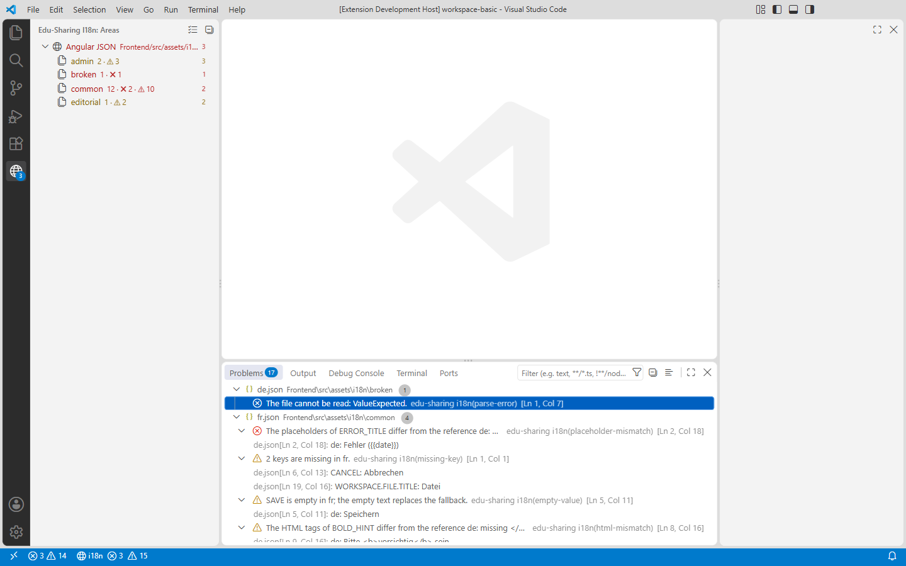
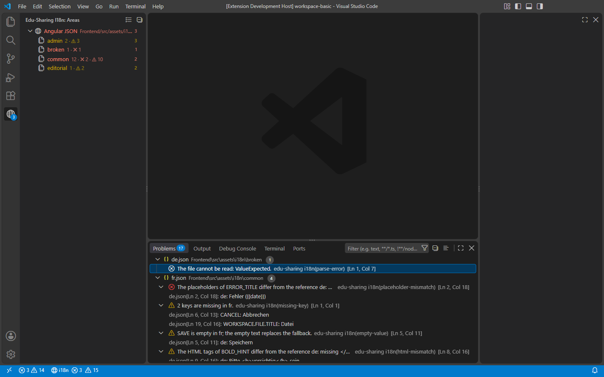
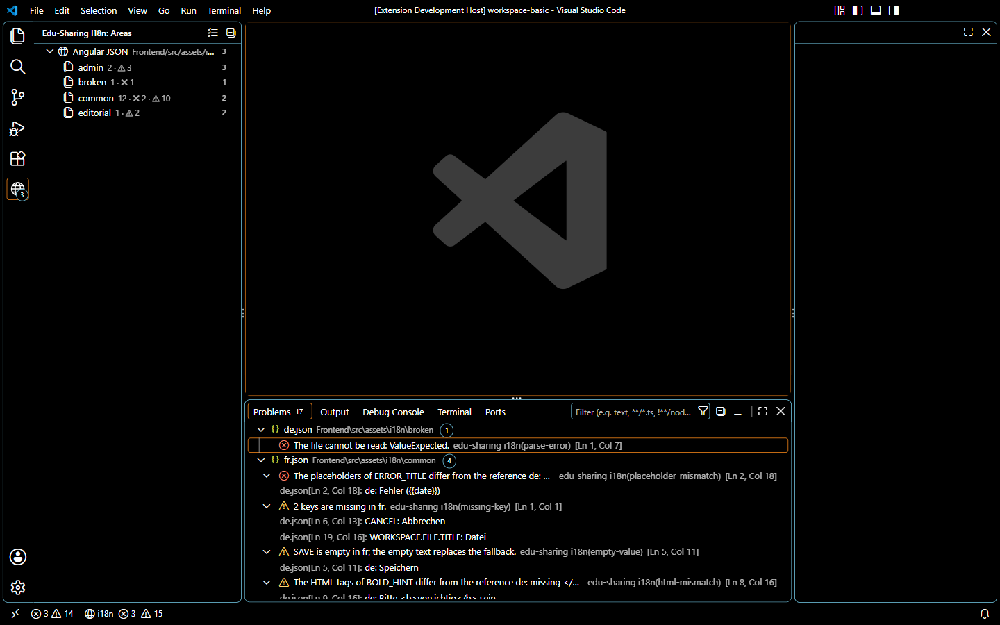

# Abnahme Phase 1 – Prüfen (Angular JSON, nur lesend)

> Gehört zu Task 1.21 in [`../plans/2026-09-24-edu-sharing-i18n-vscode-tasks.md`](../plans/2026-09-24-edu-sharing-i18n-vscode-tasks.md).
> Geprüft gegen den lokalen Clone `edu-sharing-community-repository-maven-fixes-11.0` (Branch `maven/fixes/11.0`),
> nur lesend. Stand: 24.09.2026, Branch `feat/extension-v1`.

## 1. Zahlen gegen das Design (§2.3)

Aufruf: `npm run check:repo -- "<clone>" --json`. Die Extension nutzt denselben Kern; ein Messlauf in VS Code
1.139 mit dem Clone als Workspace ergab dieselben Zahlen (17 Einheiten, 1.603 Befunde).

Ergebnis: **eine Wurzel** (`Frontend/src/assets/i18n`), **17 Einheiten**, **33 Fehler, 1.189 Warnungen, 381 Hinweise**.

| Befund (Regel) | Prototyp (Design §2.3) | Extension | Bewertung |
|---|--:|--:|---|
| fehlende Keys (`missing-key`) | 975 (common: en 89 · fr 214 · it 215) | 975 (common: en 89 · fr 214 · it 215) | gleich |
| fehlende Sprachdateien (`missing-file`) | 4 (`editorial`, `topic-page` je fr/it) | 4 (dieselben) | gleich |
| Platzhalter weichen ab (`placeholder-mismatch`) | 10 | 11 | begründet, siehe 1.1 |
| kaputte Platzhalter (`placeholder-malformed`) | 22 | 22 | gleich |
| leere Werte (`empty-value`) | 12 | 0 | begründet, siehe 1.2 |
| verwaiste Keys (`orphan-key` + `misplaced-key`) | 15 | 14 + 1 | gleich; einer hat einen Vorschlag |
| Variante nötig (`variant-needed`) | 133 · 6 | 133 (de-informal) · 6 (de-no-binnen-i) | gleich |
| überschrieben (`key-overridden`) | de 27, en 3, fr 1, it 3 | de 27, en 3, fr 1, it 3 | gleich |
| verlorene Teilbäume (`subtree-lost`) | 0 | 0 | gleich |
| identisch mit Referenz (`same-as-reference`, Hinweis) | 338 | 368 (en 208 · fr 83 · it 77) | begründet, siehe 1.3 |
| HTML weicht ab (`html-mismatch`) | – | 22 | neu; Design §6.5 |
| Variante enthält noch das Vermiedene (`variant-inconsistent`, Hinweis) | – | 7 | neu |
| Key nur in der Variante (`variant-orphan`, Hinweis) | – | 6 | neu |
| Syntaxfehler, Nicht-Text-Werte, doppelte Keys, kein UTF-8 | – | 0 | keine falschen Parse-Fehler |

### 1.1 Eine Platzhalter-Abweichung mehr

Die zusätzliche Abweichung steht in einer Variante: `admin/de-informal.json`, `ADMIN.APPLICATIONS.REMOVE_MESSAGE`
enthält `{{info}}`, `de` nicht. Der Aufruf in `admin-page.component.ts` übergibt keine Parameter, Nutzer mit
`de-informal` sähen also `{{info}}` im Dialog. Der Prototyp hat Varianten offenbar nicht mit der Referenz
verglichen (seine Liste enthält den Fall nicht); die Extension tut es, weil Variantentexte angezeigt werden.
Der Befund ist echt.

### 1.2 Keine leeren Werte

Alle leeren Texte im Repo sind auch in der Referenz `de` leer (z. B. `QUOTA.OVERALL`,
`ADMIN.IMPORT.OAI_PERSISTENT_HANDLER_CLASS_NAME_EXAMPLE`), also Absicht. `empty-value` meldet seit dem
Review von Block A/B nur noch leere Übersetzungen, deren Referenz (bei Varianten: deren Basis) Text hat
(Design §6.5). Der Fixture-Workspace deckt den gemeldeten Fall ab (`common/fr SAVE`).

### 1.3 Mehr „identisch mit Referenz"

Die Regel ist eine Heuristik mit anderer Schwelle als der Prototyp: mindestens vier sichtbare Buchstaben
(ohne Platzhalter und HTML-Tags), nur volle Sprachen, Ignorierliste `OK`, `E-Mail`, `CC-0`, `ID`. Hinweise
erscheinen nicht im Problems-Panel, nur in der Seitenleiste; die Lautstärke ist über
`eduI18n.checks.severity` und `eduI18n.checks.ignoreSameAsReference` einstellbar.

## 2. Indizierung und Leistung

Messpunkte aus dem Log „edu-sharing i18n" (je Lauf: detect, list, read, analyze), VS Code 1.139 auf dem Clone:

| Lauf | Dauer | detect | list | read | analyze |
|---|--:|--:|--:|--:|--:|
| warm (5 Läufe) | 244–363 ms | 88–95 ms | 54–65 ms | 26–35 ms | 76–168 ms |
| erster Lauf nach dem Start (Abnahmelauf) | 752 ms | 211 ms | 120 ms | 315 ms | 103 ms |
| erster Lauf nach dem Start (Messlauf, VS Code und Git starteten parallel) | 3.135 ms | 2.666 ms | 60 ms | 273 ms | 132 ms |

- Ziel „Indizierung < 1,5 s" und „alle Prüfungen < 0,5 s" (Design §8): warm und im Abnahmelauf erfüllt.
- Im langsamen Messlauf wartete der erste Lauf vor allem auf die Suche nach Markerdateien, während VS Code und die
  Git-Erweiterung den Workspace noch einlasen. ripgrep allein braucht für dieselbe Suche 136–335 ms
  (9.909 Dateien nach den Ausschlüssen). Task 2.15 behält erkannte Wurzeln künftig zwischen den Läufen.

## 3. Oberfläche

Seitenleiste, Problems-Panel und Statusleiste in Light+, Dark+ und High Contrast. Die Bilder zeigen den synthetischen
Fixture-Workspace: Aufnahmen des echten Repos enthalten edu-sharing-Texte (GPL) und bleiben deshalb außerhalb des
Repos. Der Abnahmelauf auf dem echten Repo sah genauso aus (17 Einheiten, 265 Einträge im Problems-Panel,
Statusleiste `i18n ⊗ 33 ⚠ 1.2K`).

| Light+ | Dark+ | High Contrast |
|---|---|---|
|  |  |  |

Tooltip einer Einheit (Tabelle je Sprache): 

Beobachtungen:
- Einheiten mit Fehlern oder Warnungen sind farbig und tragen ein Badge („9+" ab zehn). Im Modus hoher Kontrast
  bleiben die Namen weiß; Symbol und Zahl (`✖ 2 · ⚠ 10`) tragen die Information, nie die Farbe allein.
- Die Statusleiste zählt Befunde (Fixture: 15 Warnungen), der Zähler des Problems-Panels Diagnosen (14): Die beiden
  fehlenden Keys in `common/fr.json` sind zu einer Diagnose gebündelt (Modus `aggregate`).
- Offen für 8.2: `parse-error` zeigt den Parser-Code („The file cannot be read: ValueExpected.").

## 4. Tastatur und Screenreader-Beschriftungen

Skriptgesteuerter Durchlauf mit echten Tastenereignissen (DevTools-Protokoll) im echten Repo; ausgelesen wurde, was
ein Screenreader ansagt (`aria-label` bzw. aktive Zeile):

| Schritt | Angesagt |
|---|---|
| Befehl „Focus on Areas View", dann `↓` | „Angular JSON · Frontend/src/assets/i18n: errors 33, warnings 1,189, infos 381" |
| `↓` | „admin: keys 786, errors 20, warnings 141, infos 111" |
| `Umschalt+F10` auf einer Einheit | Kontextmenü „Check translations", „Reveal in Explorer" |
| `Strg+Umschalt+M`, erster Eintrag | „Error: The placeholders of ADMIN.APPLICATIONS.REMOVE_MESSAGE differ from the reference de: missing –, extra {{info}}. at line 15 and character 25. This problem has references to 1 locations." |
| Statusleiste | „Translations: errors 33, warnings 1,189, infos 381" |

Alle Elemente sind native VS-Code-Ansichten; Tastaturbedienung und Fokus kommen von VS Code. Offen: ein Durchlauf
mit NVDA (manuell) und eine Sichtprüfung der deutschen Oberfläche. Dafür braucht VS Code das deutsche Sprachpaket;
`--locale de` allein ändert `vscode.env.language` nicht. Die deutschen Texte selbst prüfen die l10n-Tests (vollständig,
gleiche Argumente).

## 5. Keine Schreibzugriffe

Der Clone ist ein entpacktes Archiv, kein Git-Repo. Geprüft wurde deshalb die Änderungszeit: Am Tag der Abnahme wurde
keine Datei im Clone geändert (`find … -newermt 2026-09-24` → 0 Dateien; jüngste Übersetzungsdatei vom 03.06.2026).

## 6. Tests, Abdeckung, CI

- Unit-Tests: 223 grün; Abdeckung des Kerns 97,8 % Zeilen, 90,6 % Zweige (Schwelle 90 % Zeilen).
- Integrationstests: 11 grün, jeweils in VS Code 1.139 (stable) und 1.90 (Mindestversion).
- CI (Ubuntu mit Integrationstests unter xvfb, Windows): grün für `c4f4a2e`.
- Zwei Reviews (Block A/B und C/D) mit unabhängigen Prüfern; alle Befunde behoben oder mit Begründung verschoben
  (Taskliste, Umsetzungsnotizen).

## 7. Ergebnis

Phase 1 ist abgenommen: Alle Zahlen stimmen mit dem Design überein oder sind begründet, nichts wird geschrieben, die
Abdeckung liegt über der Schwelle und CI ist grün. Offen und dem Nutzer vorgeschlagen: NVDA-Durchlauf und Sichtprüfung
der deutschen Oberfläche (je etwa zehn Minuten).
