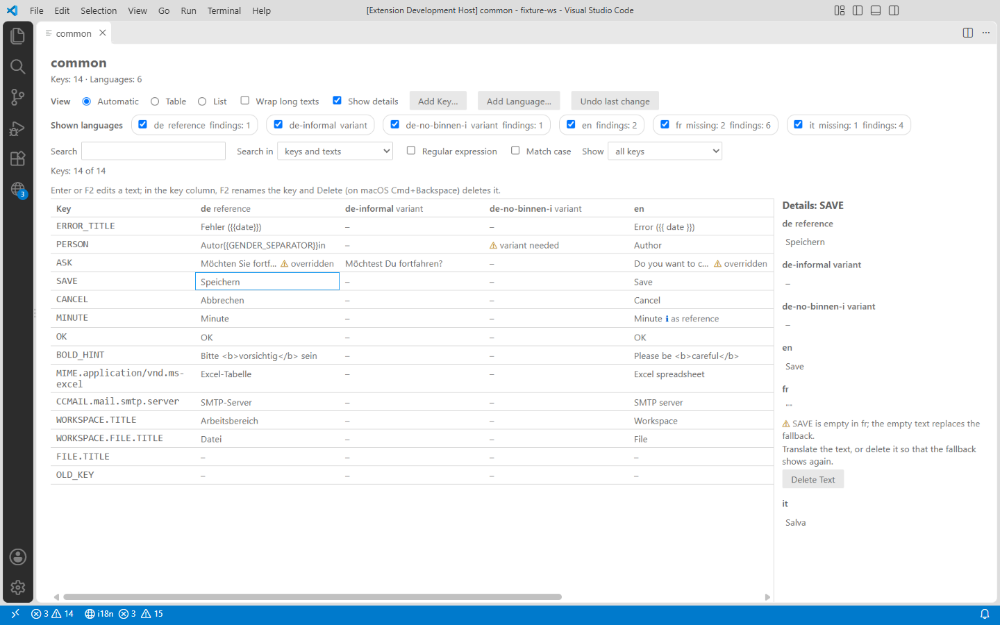
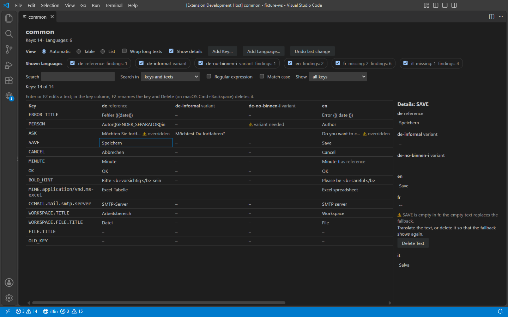
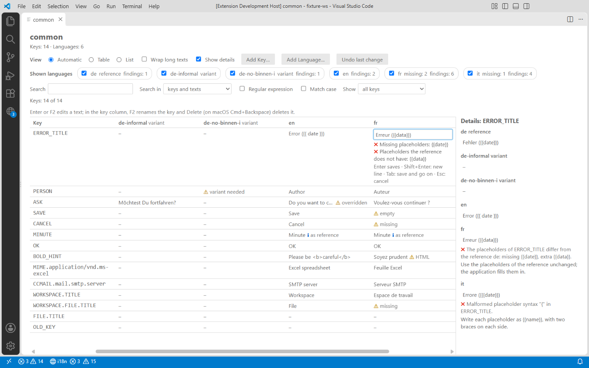
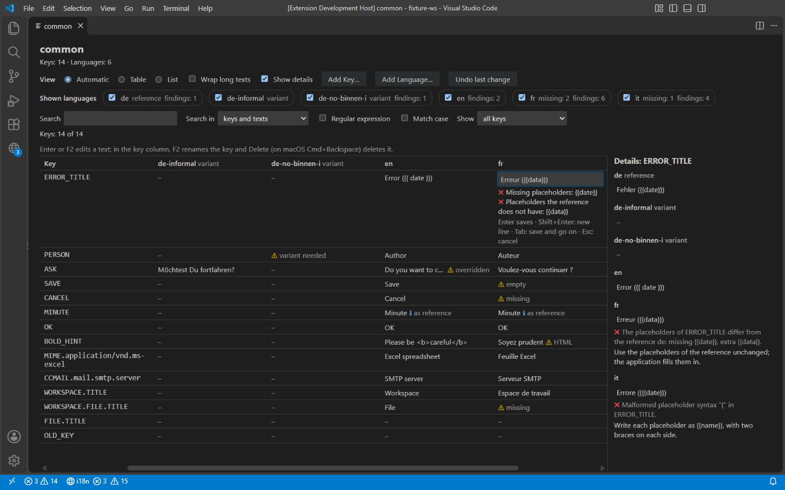
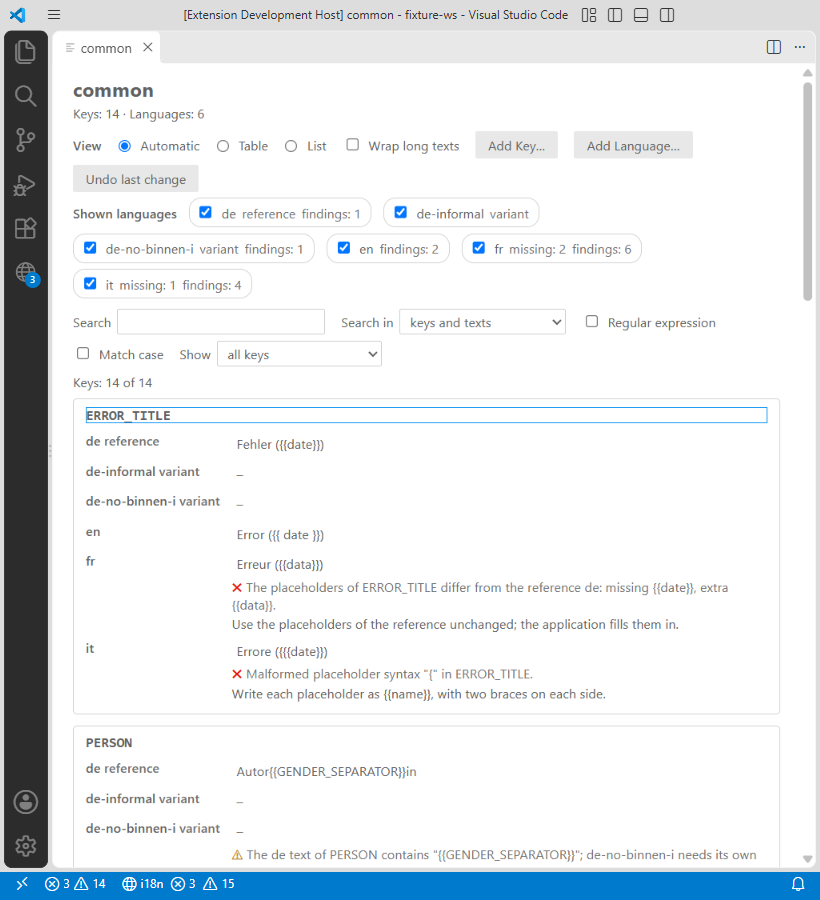
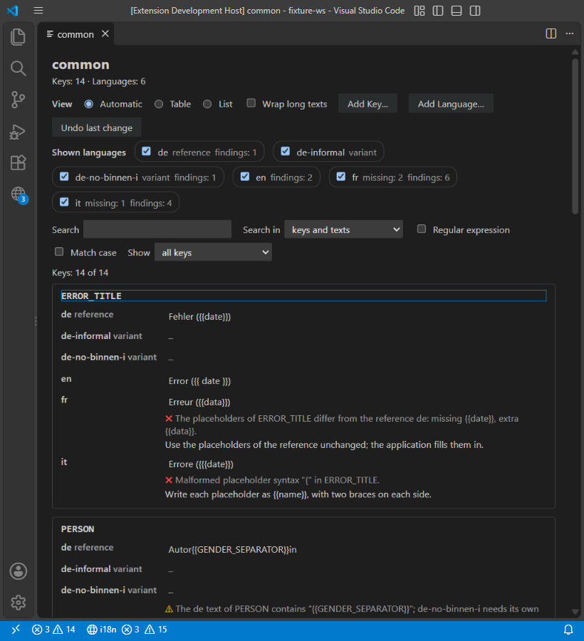
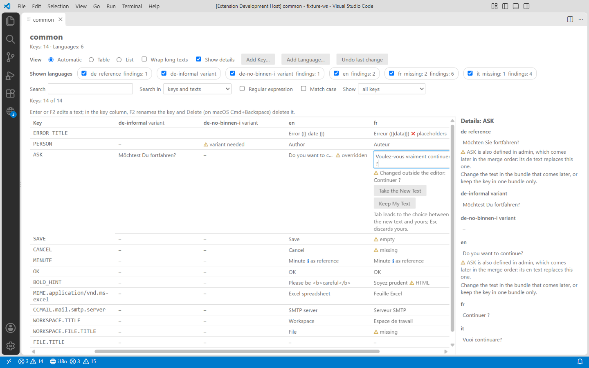

# Abnahme Phase 2 – Bearbeiten (Angular JSON)

> Gehört zu Task 2.18 in [`../plans/2026-09-24-edu-sharing-i18n-vscode-tasks.md`](../plans/2026-09-24-edu-sharing-i18n-vscode-tasks.md).
> Stand: 26.09.2026, Branch `feat/extension-v1` (Code wie in Commit `c320ba1`). Geprüft in VS Code 1.139.1 unter
> Windows 11, mit einem eigenen Profil und der Extension im Entwicklungsmodus. Die Durchläufe in VS Code steuerte
> ein Skript über das DevTools-Protokoll mit echten Tasten- und Mausereignissen.

## 1. Tests

| Prüfung | Aufruf | Ergebnis |
|---|---|---|
| Golden-Dateien des JSON-Adapters: CRLF mit BOM, Tabs, ohne Newline am Ende; je nichts ändern, setzen, einfügen (Mitte, Ende, neues Elternobjekt), löschen (Mitte, Ende, einziges Kind), umbenennen (gleiches und anderes Objekt) | `npx vitest run test/unit/core/formats/jsonNested.golden.test.ts test/unit/core/formats/jsonNested.write.test.ts` | 63 bestanden (33 Golden, 30 Schreiben) |
| alle Unit- und Komponententests | `npm run test:unit` | 594 bestanden in 66 Dateien |
| Integrationstests in VS Code stable (1.139.1) und 1.90.0 | `npm run test:integration` | je 65 bestanden, 1 ausgelassen (die Messung von 2.17, nur auf Anfrage) |
| Typen, Lint, Format | `npm run typecheck`, `npm run lint`, `npm run format:check` | ohne Befund |

## 2. Echte Dateien (Kopie): eine Zelle, eine Zeile

Die Übersetzungsdateien des Clones kamen als Kopie in ein eigenes Git-Repository außerhalb des Projekts; der Clone
wurde nur gelesen:

```bash
node scripts/perf-workspace.mjs <edu-sharing-checkout>
cp -r out/perf-workspace <kopie> && cd <kopie>
git init && git config core.autocrlf false && git add -A && git commit -m "copy of the translation files"
```

VS Code öffnete die Kopie (88 Dateien, davon 87 JSON). Im Editor der Einheit `common` (1.440 Keys, 6 Sprachen) wurde
die erste französische Zelle mit Text bearbeitet: Enter, Text anhängen, Enter.

| Schritt | Ergebnis |
|---|---|
| Speichern mit Enter | Ansage „Saved.“; `git diff --numstat`: `1 1 Frontend/src/assets/i18n/common/fr.json`. Eine Zeile ist entfernt, eine hinzugekommen, mit demselben Key und derselben Einrückung; nur der Wert ist anders. |
| Strg+Z im Editor | `git diff --numstat`: keine Änderung |
| dieselbe Zelle noch einmal bearbeitet | wieder genau eine Zeile in `common/fr.json` |
| Befehl „Restore translation files from a backup…“ | Angeboten wird eine Sicherung: „Before the first change of a session“, 87 Dateien. Die Rückfrage „Restore the translation files from …? The current state is backed up first.“ wird mit „Restore“ bestätigt. |
| danach | `git diff --numstat`: keine Änderung; `git status --porcelain`: leer, also auch keine neuen Dateien im Arbeitsbereich |

Die Texte der Dateien stehen hier nicht (edu-sharing ist GPL). Das Skript prüfte am Diff, dass Key und Einrückung
gleich blieben und nur der angehängte Text dazukam.

## 3. Oberfläche (synthetische Daten)

Die Bilder zeigen den Fixture-Arbeitsbereich `test/fixtures/workspace-basic`, Einheit `common` (14 Keys, 6 Sprachen),
bei 1.440 × 900 px mit geschlossener Seitenleiste. VS Code lief ohne deutsches Sprachpaket und damit englisch. Die
deutschen Texte prüfen die Komponententests, die mit dem deutschen Katalog laufen.

| | Light+ | Dark+ |
|---|---|---|
| Tabelle mit Details. Aktiv ist SAVE; sein französischer Text ist leer, mit Befund, Hinweis und „Delete Text“. |  |  |
| Editor in der Zelle (ERROR_TITLE, fr) mit der Prüfung gegen die Referenz und den Tasten |  |  |
| Liste bei 820 px; die erste Karte hat den Fokus, den das Grid übergab |  |  |

Konflikt: ASK wird auf Französisch bearbeitet, während ein anderes Programm die Datei ändert. Der Entwurf bleibt,
darunter stehen der neue Text und die Wahl zwischen beiden:



Beobachtungen:
- Passen die sechs Sprachen nicht neben die Details, scrollt die Tabelle waagerecht; die Key-Spalte bleibt stehen.
  Der Fokus auf einer weit rechts liegenden Zelle schiebt die Referenzspalte hinter die Key-Spalte (Konfliktbild).
- Befunde stehen als Symbol und Wort in der Zelle, in den Details mit Erklärung und Hinweis. Die Farbe ist nie das
  einzige Zeichen.

## 4. Tastatur in VS Code

Ein Durchlauf mit echten Tastenereignissen in VS Code. Ausgelesen wurde, was ein Screenreader bekommt: Rolle, Name,
Beschreibung, `aria-keyshortcuts` und die Ansagen der Live-Region.

| Taste | Fokus und Ansage |
|---|---|
| Editor öffnen | Ansage „common is open. Keys: 14 · Languages: 6“ |
| Tab 1–19 | Sprunglinks zur Suche und zur Tabelle; Ansicht (Radiogruppe, ein Halt); „Wrap long texts“; „Show details“; „Add Key…“; „Add Language…“; „Undo last change“ (`Control+Z Meta+Z`); ein Kontrollkästchen je Sprache mit Zählern („fr missing: 2 findings: 6“); Suche (`Control+F Meta+F`); „Search in“; „Regular expression“; „Match case“; „Show“ (`Alt+M`) |
| Tab 20 | das Grid, ein Halt: Zelle „Fehler ({{date}})“, Tasten `Enter F2` |
| Strg+Pos1, ↓ | Kopfzelle „Key“; Zeilenkopf „ERROR_TITLE“, Tasten `F2 Delete` |
| 5 × → | Zelle fr: „Erreur ({{data}}) ✖ placeholders“, beschrieben durch den Befund („Error: The placeholders of ERROR_TITLE differ from the reference de: missing {{date}}, extra {{data}}.“) |
| Enter | Feld „ERROR_TITLE in fr“, beschrieben durch die Prüfung („✖ Error: Missing placeholders: {{date}}“ …) und die Tasten |
| Strg+A, „Erreur ({{date}})“ tippen | Prüfung: „✓ Placeholders and HTML tags as in the reference.“ |
| Esc | wieder auf der Zelle, nichts gesendet |
| ↓ ↓ →, Enter, Text anhängen, Enter | Ansage „Saved.“; der Fokus bleibt auf der Zelle, die den neuen Text zeigt |
| Strg+Z | Der alte Text ist zurück, der Fokus bleibt. |
| Konflikt (die Datei ändert sich während der Bearbeitung) | Ansage „ASK in fr changed outside the editor. Take the new text, or keep yours.“ Enter führt zu „Take the New Text“; Esc verwirft den Entwurf, und der Fokus steht auf der Zelle mit dem neuen Text. |
| Fenster schmaler (Liste) | Der Fokus geht mit: auf die Karte des Keys und das Feld derselben Sprache, aus der Kopfzeile auf die erste Karte. |

Dieselbe Tab-Reihenfolge und die Fokusregeln prüfen Komponententests in der CI, auf Deutsch (`keyboardWalk.test.tsx`,
`cellEditor.test.tsx`, `list.test.tsx`).

## 5. Barrierefreiheit und Screenreader

Automatisch geprüft sind axe in jeder Komponententest-Datei, die Kontraste von sechs Themes und die Themes mit
hohem Kontrast in Chromium, siehe [`phase-2-a11y.md`](phase-2-a11y.md).

**Offen, von Hand:** NVDA mit VS Code auf Deutsch, nach der Checkliste in Abschnitt 5 des Protokolls. Was ein
Screenreader tatsächlich spricht, lässt sich nicht automatisiert prüfen; Abschnitt 4 zeigt nur, was er bekommt.

## 6. Messwerte (Task 2.17)

Gemessen mit einer Kopie der echten Dateien (87 Dateien; `common` mit 1.440 Keys × 6 Sprachen) in VS Code 1.139:

| Messung | Wert | Ziel (Design §8) |
|---|--:|---|
| voller Index, warm | 212–222 ms | < 1,5 s |
| Wurzel neu, Dateien unverändert | 97–107 ms | – |
| Modell von `common` bauen / Patch berechnen | 6–8 ms / 4–6 ms | – |
| Editor öffnen, bis das Modell gesendet ist | 208–266 ms | < 1 s |
| Zelle speichern, bis die Antwort kommt | 28–42 ms | < 150 ms |
| … bis die Befunde da sind (Patch) | 196–198 ms | – |
| erstes Speichern einer Sitzung, mit Sicherung aller 87 Dateien | 362–492 ms | – |

In Chromium mit dem echten Webview-Bundle und 2.002 Keys × 6 Sprachen:
- Der erste Aufbau dauert 30–50 ms: 200 Zeilen sofort, dann 200 je Task.
- Eine Pfeiltaste braucht 3,6–7,1 ms, ein Tastendruck im Editor 2,7–5,7 ms.

## 7. Ergebnis

| Kriterium (Task 2.18) | Stand |
|---|---|
| Golden-Tests grün | erfüllt (Abschnitt 1) |
| Eine Zelle in einer Kopie des echten Repos geändert, `git diff` zeigt genau eine Zeile | erfüllt (Abschnitt 2) |
| Undo und Backup stellen wieder her | erfüllt (Abschnitt 2) |
| Screenshots der Ansichten in Light+ und Dark+ | erfüllt, aus synthetischen Daten (Abschnitt 3) |
| Tastaturprotokoll | erfüllt (Abschnitt 4) |
| NVDA-Protokoll | offen, von Hand (Abschnitt 5) |
| Messwerte aus 2.17 | übernommen (Abschnitt 6) |

Ebenfalls noch von Hand zu prüfen, wie in den Notizen zu 2.14 und 2.16 vermerkt:
- die Dialoge der Key-Befehle und die Rückfrage beim Leeren eines Textes;
- das Kontextmenü im Editor und seine Titelleiste;
- eine Sichtprüfung in High Contrast und High Contrast Light in VS Code selbst (in Chromium sind beide geprüft).

Die Wiederherstellung einer Sicherung lief oben schon durch VS Codes Dialog.
